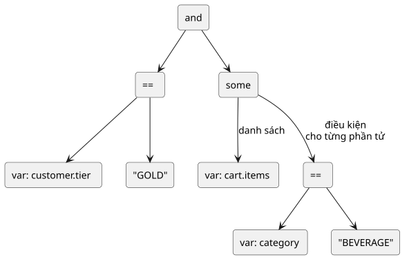

# CHƯƠNG 2. CƠ SỞ LÝ THUYẾT

Chương này trình bày các cơ sở lý thuyết và phương pháp mà đồ án sử dụng. Nội dung đi từ khái niệm luật nghiệp vụ và hệ quản trị luật nghiệp vụ, qua chuẩn DMN và các mô hình thực thi luật, đến cách biểu diễn điều kiện an toàn bằng AST, quản lý phiên bản, lập trình đồng thời trong Go, và cuối cùng là mô hình C4 cùng UML dùng để mô tả kiến trúc ở Chương 3. Mỗi mục kết thúc bằng lựa chọn cụ thể của đồ án và lý do của lựa chọn đó.

## 2.1. Luật nghiệp vụ và hệ quản trị luật nghiệp vụ

Định nghĩa được trích dẫn nhiều nhất về luật nghiệp vụ đến từ báo cáo của Business Rules Group: "*A business rule is a statement that defines or constrains some aspect of the business. It is intended to assert business structure or to control or influence the behavior of the business.*" [29, tr. 4–5]. Chuẩn Semantics of Business Vocabulary and Business Rules (SBVR) của Object Management Group (OMG) chuẩn hoá khái niệm này theo cách chặt chẽ hơn: luật nghiệp vụ là luật có thể áp dụng được và thuộc thẩm quyền của doanh nghiệp, nghĩa là có một bên có thẩm quyền được quyền thay đổi hoặc huỷ bỏ luật đó [30, tr. 98]. Hai định nghĩa thống nhất ở một điểm quan trọng với đồ án: luật thuộc về nghiệp vụ, nên quyền thay đổi luật cũng thuộc về nghiệp vụ chứ không thuộc về chu kỳ phát hành phần mềm.

Báo cáo của Business Rules Group chia luật nghiệp vụ thành bốn loại: định nghĩa thuật ngữ, quan hệ giữa các thuật ngữ, ràng buộc (action assertion) và suy diễn (derivation) [29, tr. 6]. Trong đó, luật suy diễn xác định cách biến đổi tri thức ở một dạng thành tri thức ở dạng khác [29, tr. 6]. Đối chiếu với đồ án, mỗi luật trong một quyết định thuộc loại suy diễn: từ các dữ kiện đầu vào, luật suy ra kết quả đầu ra. Hai loại đầu tương ứng với lược đồ dữ liệu đầu vào của quyết định, còn loại ràng buộc tương ứng một phần với bước kiểm tra lược đồ đầu vào trước khi đánh giá.

Cũng theo báo cáo này, luật nghiệp vụ mang tính khai báo, không mang tính thủ tục: luật mô tả một trạng thái được mong muốn, bắt buộc hoặc bị cấm, nhưng không mô tả các bước để đạt tới trạng thái đó [29, tr. 8]. Đây là cơ sở để đồ án biểu diễn luật dưới dạng dữ liệu (bảng quyết định và cây điều kiện) thay vì dưới dạng mã thủ tục.

Ở góc độ thực thi, chuẩn Production Rule Representation (PRR) của OMG định nghĩa luật sản xuất (production rule) là một phát biểu chỉ định việc thực thi một hoặc nhiều hành động khi các điều kiện của nó được thoả mãn, với dạng tổng quát "*if [condition] then [action-list]*" [31, tr. 6]. Các luật sản xuất được gom trong một tập luật, đóng vai trò đơn vị thực thi của rule engine [31, tr. 7]. Hai khái niệm này tương ứng trực tiếp với luật và tập luật trong đồ án.

Hệ quản trị luật nghiệp vụ (Business Rule Management System – BRMS) chưa có định nghĩa trong một đặc tả chuẩn của OMG hay ISO. Mô tả của các nhà cung cấp cho thấy một BRMS điển hình cho phép tạo, quản lý, kiểm thử và quản trị luật nghiệp vụ, đồng thời lưu luật trong một kho tập trung mà nhiều người và nhiều phần mềm cùng truy cập [32]. Các chức năng này khớp với yêu cầu của Business Rules Manifesto rằng nền tảng phải hỗ trợ thay đổi luật liên tục và người làm nghiệp vụ phải có công cụ để soạn, kiểm định và quản lý luật [4]. Từ đó, đồ án hiểu một BRMS gồm hai phần: rule engine thực thi luật, và lớp quản trị vòng đời luật. Kiến trúc của đồ án ở Chương 3 tách đúng hai phần này thành lõi BRE và lớp quản trị.

## 2.2. Chuẩn DMN

Decision Model and Notation (DMN) là chuẩn của OMG để mô hình hoá quyết định; phiên bản chính thức mới nhất là DMN 1.6 [5]. Chuẩn mô tả quyết định ở hai tầng: tầng yêu cầu quyết định, thể hiện các quyết định và quan hệ phụ thuộc giữa chúng; và tầng logic quyết định, thể hiện cách mỗi quyết định tính ra kết quả, trong đó bảng quyết định là hình thức tiêu biểu.

### 2.2.1. Mô hình quyết định

Ở tầng yêu cầu, DMN dùng một đồ thị yêu cầu quyết định (Decision Requirements Graph), được thể hiện bằng một hoặc nhiều sơ đồ yêu cầu quyết định [5, tr. 21]. Các phần tử chính của đồ thị gồm [5, tr. 21]:

- **Decision**: hành động xác định một đầu ra từ một số đầu vào bằng logic quyết định.
- **Input Data**: thông tin được một hoặc nhiều Decision dùng làm đầu vào.
- **Business Knowledge Model**: một hàm đóng gói tri thức nghiệp vụ, chẳng hạn một tập luật hoặc một bảng quyết định.
- **Knowledge Source**: nguồn có thẩm quyền đối với một Decision hoặc Business Knowledge Model.

Giữa các phần tử có ba loại quan hệ: yêu cầu thông tin, yêu cầu tri thức và yêu cầu thẩm quyền [5, tr. 21].

Đồ án chỉ hiện thực tầng logic quyết định. Mỗi quyết định trong đồ án tương ứng với một Decision của DMN, dữ kiện tương ứng với Input Data, và logic của mỗi quyết định là đúng một bảng quyết định. Đồ án không hiện thực đồ thị nhiều quyết định phụ thuộc nhau; nếu cần kết hợp nhiều quyết định, ứng dụng gọi sẽ gọi lần lượt từng quyết định. Đây là một giới hạn phạm vi có chủ ý, giúp mỗi lần đánh giá chỉ liên quan tới một tập luật và một vết đánh giá.

### 2.2.2. Bảng quyết định

DMN định nghĩa bảng quyết định là "*a tabular representation of a set of related input and output expressions, organized into rules indicating which output entry applies to a specific set of input entries.*" [5, tr. 65]. Một bảng quyết định gồm danh sách mệnh đề đầu vào, danh sách mệnh đề đầu ra (ít nhất một) và danh sách luật (ít nhất một); mỗi luật gồm các ô đầu vào và các ô đầu ra trên một dòng của bảng [5, tr. 65].

Cách đọc một luật được chuẩn quy định rõ: một luật khớp khi giá trị của mọi biểu thức đầu vào thoả mãn ô đầu vào tương ứng [5, tr. 67]. Ô có giá trị "-" nghĩa là đầu vào đó không liên quan tới luật, mọi giá trị đều thoả mãn [5, tr. 67]. Mỗi ô đầu vào là một phép kiểm tra một ngôi (unary test) trên giá trị của cột [5, tr. 72]. Chuẩn cũng yêu cầu việc đánh giá biểu thức đầu vào không gây tác dụng phụ ảnh hưởng tới việc đánh giá các biểu thức hay luật khác trong cùng bảng [5, tr. 72]. Khi không có luật nào khớp, kết quả là giá trị đầu ra mặc định nếu được khai báo, hoặc null nếu không [5, tr. 120].

Bảng 2.1 minh hoạ một bảng quyết định cho quyết định `calculate-pos-discounts`, ví dụ xuyên suốt của đồ án. Hai cột đầu vào là hạng khách hàng và tổng giá trị giỏ hàng; cột đầu ra là mã chiết khấu được áp dụng.

**Bảng 2.1.** Bảng quyết định minh hoạ cho quyết định `calculate-pos-discounts` (hit policy COLLECT)

| Luật | `customer.tier` | `cart.total` | Mã chiết khấu |
|------|-----------------|--------------|---------------|
| 1 | `"GOLD"` | - | `GOLD_5PCT` |
| 2 | - | `>= 1000000` | `BIG_CART` |
| 3 | `"SILVER", "GOLD"` | `>= 500000` | `LOYAL_CART` |

Với dữ kiện khách hàng hạng GOLD có giỏ hàng trị giá 1.200.000 đồng, cả ba luật trong Bảng 2.1 đều khớp. Vì vậy, hit policy của bảng quyết định cách tổng hợp ba kết quả đó (xem mục 2.2.3).

Không phải điều kiện nào cũng biểu diễn được bằng một ô. Một chính sách như "giỏ hàng có ít nhất một sản phẩm thuộc nhóm đồ uống" là điều kiện trên một tập hợp, không phải phép so sánh trên một giá trị đơn. Trong DMN, các ô được viết bằng ngôn ngữ biểu thức Friendly Enough Expression Language (FEEL), một ngôn ngữ không có tác dụng phụ, dùng logic ba giá trị (đúng, sai, null) [5, tr. 89]. FEEL có hai lượng từ `some` và `every` trên danh sách [5, tr. 105]; khi danh sách rỗng, `some` trả về false và `every` trả về true [5, tr. 127]. Chuẩn còn định nghĩa S-FEEL, một tập con đơn giản của FEEL dành cho các mô hình chủ yếu dùng bảng quyết định [5, tr. 83].

Đồ án không hiện thực FEEL. Mỗi ô của bảng quyết định được phân tích thành một nút điều kiện trên AST (xem mục 2.4); điều kiện trên tập hợp được viết trực tiếp dưới dạng cây điều kiện với các lượng từ `some`, `all` và `none`. Các lượng từ này tuân theo cùng quy ước về danh sách rỗng như FEEL, trong đó `none` là phủ định của `some`. Về xử lý dữ liệu thiếu, FEEL dùng null cho cả dữ liệu thiếu lẫn lỗi thực thi. Phương ngữ B-FEEL trong DMN 1.6 tách hai trường hợp này: các phép so sánh luôn trả về đúng hoặc sai, không trả null, và vẫn phát sinh cảnh báo khi có lỗi [5, tr. 169]. Đồ án theo cách tiếp cận gần với B-FEEL: so sánh trên một trường dữ kiện bị thiếu cho kết quả sai và một cảnh báo được ghi vào vết đánh giá.

### 2.2.3. Hit policy

Theo DMN, hit policy xác định kết quả của bảng quyết định trong trường hợp các luật chồng lấn, tức là khi nhiều luật cùng khớp với dữ liệu đầu vào [5, tr. 73]. Chuẩn định nghĩa bảy hit policy, chia làm hai nhóm: nhóm một kết quả (single hit) chỉ trả về đầu ra của một luật, còn nhóm nhiều kết quả (multiple hit) có thể trả về đầu ra của nhiều luật [5, tr. 74]. Bảy hit policy được tóm tắt trong Bảng 2.2.

**Bảng 2.2.** Các hit policy trong chuẩn DMN 1.6

| Hit policy | Nhóm | Ý nghĩa |
|------------|------|---------|
| Unique (U) | Một kết quả | Các luật không chồng lấn; chỉ một luật có thể khớp. Là hit policy mặc định. |
| Any (A) | Một kết quả | Có thể chồng lấn nhưng mọi luật khớp phải có cùng đầu ra. |
| Priority (P) | Một kết quả | Trả về luật khớp có đầu ra ưu tiên cao nhất, theo thứ tự trong danh sách giá trị đầu ra. |
| First (F) | Một kết quả | Trả về luật khớp đầu tiên theo thứ tự luật. |
| Output order (O) | Nhiều kết quả | Trả về mọi luật khớp, xếp theo mức ưu tiên của giá trị đầu ra. |
| Rule order (R) | Nhiều kết quả | Trả về mọi luật khớp theo thứ tự luật. |
| Collect (C) | Nhiều kết quả | Trả về mọi luật khớp theo thứ tự bất kỳ, hoặc kết quả của một phép gộp: tổng (+), nhỏ nhất (<), lớn nhất (>), đếm (#). |

Nguồn: Tổng hợp từ [5, tr. 74–75]

DMN không bắt buộc một công cụ phải hỗ trợ đủ bảy hit policy: "*Tools may support only a nonempty subset of hit policies, but the table type SHALL be clear and therefore the hit policy indication is mandatory, except for the default unique tables. Unique tables SHALL always be supported.*" [5, tr. 74]. Dựa trên điều khoản này, đồ án chọn bốn hit policy phù hợp với các quyết định thí điểm:

- **UNIQUE**: hit policy bắt buộc theo chuẩn, dùng cho các quyết định mà các luật phải loại trừ nhau, như phân hạng khách hàng theo khoảng giá trị. Nếu có từ hai luật trở lên cùng khớp, việc đánh giá bị từ chối với lỗi rõ ràng, giúp phát hiện các khoảng chồng lấn.
- **FIRST**: trả về luật khớp đầu tiên theo thứ tự luật. Chuẩn nhận xét rằng bảng dạng này không cho cái nhìn tổng quan rõ ràng về logic quyết định [5, tr. 74]. Tuy vậy, FIRST phù hợp với các quyết định điều khiển có thứ tự ưu tiên tự nhiên, như lệnh tưới tiêu, nơi luật cuối thường là luật mặc định.
- **PRIORITY**: chọn một luật trong số các luật khớp theo mức ưu tiên.
- **COLLECT**: trả về đầu ra của mọi luật khớp, dùng cho các quyết định cộng dồn như chiết khấu giỏ hàng.

Hai hit policy được chọn có ngữ nghĩa khác với chuẩn, và đồ án nêu rõ để tránh hiểu nhầm. Thứ nhất, Priority trong DMN xếp hạng theo thứ tự của danh sách giá trị đầu ra, và chuẩn nhấn mạnh rằng mức ưu tiên này độc lập với thứ tự luật [5, tr. 74]. Cách này giả định đầu ra là một tập giá trị liệt kê được, như "phê duyệt", "xem xét", "từ chối". Trong đồ án, đầu ra của một luật có thể là một đối tượng gồm nhiều trường, như mã lệnh kèm tham số. Thứ tự giá trị đầu ra vì thế không xác định được. Đồ án giữ tên PRIORITY nhưng xếp hạng theo trọng số ưu tiên gắn với từng luật. Thứ hai, Collect trong DMN cho phép trả kết quả theo thứ tự bất kỳ hoặc kèm phép gộp. Đồ án luôn trả danh sách theo thứ tự luật, vẫn nằm trong phạm vi "thứ tự bất kỳ" mà chuẩn cho phép, đồng thời giúp kết quả mang tính xác định. Đồ án cũng không hiện thực các phép gộp; ứng dụng gọi tự tính tổng nếu cần, phù hợp với phạm vi đã loại trừ các phép tính số học phức tạp. Với Bảng 2.1, kết quả của COLLECT là danh sách `GOLD_5PCT`, `BIG_CART`, `LOYAL_CART` theo đúng thứ tự này.

Khi không có luật nào khớp, đồ án trả về kết quả quyết định không có đầu ra, với mọi hit policy, tương tự giá trị null của DMN. Trường hợp này không bị coi là lỗi; ứng dụng gọi nhận biết qua danh sách luật khớp rỗng trong bản tóm tắt vết.

Do chỉ hiện thực một phần chuẩn và dùng AST thay cho FEEL, đồ án không tuyên bố tuân thủ DMN ở bất kỳ mức nào. Chuẩn quy định rõ trường hợp này: "*Software developed only partially matching the applicable compliance points may claim that the software was based on this specification but may not claim compliance or conformance with this specification.*" [5, tr. 1]. Vì vậy, đồ án mô tả hệ thống là được xây dựng dựa trên DMN.

## 2.3. Mô hình thực thi luật

Chuẩn PRR mô tả ngữ nghĩa thực thi tổng quát của luật sản xuất trong một rule engine suy diễn tiến gồm ba bước lặp lại: so khớp (match) các luật với trạng thái hiện tại của dữ liệu, giải quyết xung đột (conflict resolution) để chọn luật được thực thi, và thực thi (act) hành động của luật được chọn, làm thay đổi dữ liệu [31, tr. 8]. PRR cũng lưu ý rằng khi không dùng rule engine mà xử lý luật tuần tự đơn giản, không có bước giải quyết xung đột [31, tr. 8]. Hai cách thực thi này được trình bày lần lượt dưới đây.

### 2.3.1. Đánh giá tuần tự

PRR định nghĩa luật sản xuất tuần tự là luật không bị sắp xếp lại thứ tự trong quá trình thực thi [31, tr. 8]. Các luật được đánh giá dựa trên trạng thái ban đầu của dữ liệu, và tác dụng phụ của việc thực thi một luật không ảnh hưởng tới việc các luật khác có được thực thi hay không [31, tr. 9]. Thứ tự thực thi do thứ tự khai báo của luật trong tập luật quyết định [31, tr. 9]. Drools cũng có chế độ tương tự cho phiên làm việc không trạng thái: trong chế độ tuần tự, engine đánh giá các luật một lần theo thứ tự, bỏ qua mọi thay đổi trên bộ nhớ làm việc [7].

Đồ án áp dụng mô hình đánh giá tuần tự một lượt. Với mỗi lần gọi, engine nhận một tập dữ kiện bất biến, đánh giá điều kiện của từng luật trong tập luật theo thứ tự khai báo, ghi nhận các luật khớp, rồi dùng hit policy để tổng hợp kết quả. Kết quả đầu ra của một luật không được ghi ngược vào dữ kiện, nên không có luật nào bị kích hoạt lại. Hit policy đóng vai trò thay cho bước giải quyết xung đột: nó quyết định cách gộp các luật đã khớp chứ không quyết định thứ tự thực thi. Mô hình này có ba hệ quả có lợi cho đồ án. Kết quả chỉ phụ thuộc vào dữ kiện và phiên bản tập luật, nên luôn tái hiện được. Mỗi lần đánh giá không giữ trạng thái giữa các lần gọi, nên nhiều yêu cầu có thể chạy song song trên cùng một tập luật. Kết quả điều kiện của từng luật được tính đúng một lần, nên vết đánh giá ghi lại được trọn vẹn và dễ đọc.

### 2.3.2. Thuật toán Rete

Trong suy diễn tiến, thứ tự thực thi không do thứ tự khai báo quyết định mà do engine điều khiển, dựa trên một biểu diễn có trạng thái về các ràng buộc giữa luật và dữ liệu; chu trình so khớp, chọn và thực thi được lặp lại cho tới khi không còn luật nào khớp [31, tr. 8]. Một hành động có thể sửa dữ liệu, từ đó làm thay đổi kết quả so khớp hiện tại và về sau [31, tr. 8]. Drools phân biệt hệ suy diễn tiến, hướng dữ liệu, bắt đầu từ dữ kiện và phản ứng với thay đổi của dữ kiện, với hệ suy diễn lùi, hướng mục tiêu, bắt đầu từ một kết luận và tìm cách thoả mãn nó, thường bằng đệ quy [7].

Thuật toán Rete do Charles Forgy công bố năm 1982 [3] là thuật toán phổ biến để hiện thực suy diễn tiến [31, tr. 8]. Ý tưởng của Rete là lưu lại các kết quả so khớp từng phần giữa luật và dữ kiện, để khi dữ kiện thay đổi, engine chỉ cần tính lại phần bị ảnh hưởng thay vì so khớp lại toàn bộ. Tài liệu Drools mô tả Rete là thuật toán "háo hức": nó thực hiện nhiều thao tác ngay khi chèn, cập nhật hay xoá dữ kiện để tìm các so khớp từng phần cho mọi luật, và điều này tốn nhiều thời gian trước khi luật thực sự được thực thi, nhất là trong các hệ thống lớn [7]. Chính Drools đã chuyển sang thuật toán Phreak với chiến lược đánh giá trì hoãn [7]. Bảng 2.3 so sánh hai mô hình thực thi theo các đặc điểm liên quan tới đồ án.

**Bảng 2.3.** So sánh đánh giá tuần tự và suy diễn tiến theo thuật toán Rete

| Đặc điểm | Đánh giá tuần tự | Suy diễn tiến (Rete) |
|----------|------------------|----------------------|
| Trạng thái giữa các lần gọi | Không có | Mạng so khớp và bộ nhớ làm việc |
| Dữ kiện trong một lần gọi | Bất biến | Có thể bị hành động của luật sửa đổi |
| Thứ tự thực thi | Theo thứ tự khai báo luật | Do engine quyết định qua giải quyết xung đột |
| Số lượt đánh giá | Một lượt | Lặp tới khi không còn luật khớp |
| Lợi thế | Đơn giản, xác định, dễ giải trình | Hiệu quả khi dữ kiện thay đổi liên tục và có nhiều luật |

Nguồn: Tổng hợp từ [31, tr. 8–9], [7]

Đồ án không chọn Rete vì những lợi thế của Rete không phát huy trong bài toán của đồ án. Rete tối ưu cho trường hợp dữ kiện được sửa đổi liên tục trong một phiên làm việc có trạng thái. Trong khi đó, lõi của đồ án là một hàm thuần: dữ kiện bất biến trong mỗi lần gọi và không có hành động nào sửa dữ kiện, nên không có gì cần so khớp lại. Hơn nữa, suy diễn nối tiếp làm cho việc lập luận và gỡ lỗi trở nên khó khăn [6], đi ngược với yêu cầu giải trình được mọi quyết định. Cuối cùng, mỗi quyết định thí điểm chỉ có từ vài đến vài chục luật, quy mô mà đánh giá tuần tự đáp ứng được mà không cần cấu trúc so khớp phức tạp.

## 2.4. Biểu diễn điều kiện an toàn bằng cây cú pháp trừu tượng

Cách đơn giản nhất để lưu điều kiện của luật dưới dạng cấu hình là viết điều kiện thành một chuỗi biểu thức rồi đánh giá chuỗi đó lúc chạy bằng một hàm kiểu `eval`. Cách này mở ra lỗ hổng chèn mã (code injection), tức các kiểu tấn công chèn mã để ứng dụng thông dịch hoặc thực thi, lợi dụng việc xử lý kém dữ liệu không tin cậy [33]. Danh mục điểm yếu phần mềm Common Weakness Enumeration (CWE) xếp trường hợp này vào CWE-95, chèn mã qua lời gọi đánh giá động như `eval` [34], một trường hợp riêng của CWE-94, kiểm soát không đúng việc sinh mã [35]. Biện pháp được khuyến nghị cho cả hai là tái cấu trúc chương trình để không phải sinh mã động [35] và, nếu có thể, không dùng `eval` [34].

Đồ án tránh hoàn toàn lỗ hổng này bằng cách biểu diễn điều kiện dưới dạng cây cú pháp trừu tượng. AST là cấu trúc cây phản ánh cấu trúc ngữ pháp của một biểu thức: mỗi nút trong là một toán tử, các nút con là toán hạng, còn các nút lá là hằng số hoặc tham chiếu tới một trường dữ kiện. Chính ngôn ngữ Go cũng biểu diễn chương trình theo cách này: gói `go/ast` khai báo các kiểu dùng để biểu diễn cây cú pháp, trong đó mọi nút cài đặt chung giao diện `Node`, mọi nút biểu thức cài đặt giao diện `Expr`, và hàm `Walk` duyệt cây theo chiều sâu [36].

Tiền lệ gần nhất cho việc lưu luật dưới dạng AST bằng JSON là JsonLogic. Theo trang của dự án, JsonLogic cho phép xây dựng luật phức tạp, tuần tự hoá thành JSON và dùng chung giữa giao diện và máy chủ; luật không có phép gán, vòng lặp hay hàm, không có tác dụng phụ, và thư viện không bao giờ dùng `eval` [37]. Mỗi nút có dạng `{"toán tử": [các tham số]}` [37]. JsonLogic có sẵn các toán tử `all`, `none` và `some` trên mảng, trong đó tham chiếu trường bên trong phép kiểm tra được tính tương đối theo phần tử đang xét [38]. Đoạn mã 2.1 biểu diễn điều kiện "khách hàng hạng GOLD và giỏ hàng có ít nhất một sản phẩm thuộc nhóm đồ uống" theo cú pháp JsonLogic.

**Đoạn mã 2.1.** Một điều kiện của quyết định `calculate-pos-discounts` theo cú pháp JsonLogic

```json
{
  "and": [
    { "==": [{ "var": "customer.tier" }, "GOLD"] },
    {
      "some": [
        { "var": "cart.items" },
        { "==": [{ "var": "category" }, "BEVERAGE"] }
      ]
    }
  ]
}
```

Cấu trúc cây tương ứng với Đoạn mã 2.1 được thể hiện trong Hình 2.1. Nút gốc `and` có hai nhánh: nhánh trái so sánh hạng khách hàng, nhánh phải là lượng từ `some` trên danh sách sản phẩm, với điều kiện con được đánh giá cho từng sản phẩm.



**Hình 2.1.** Cây cú pháp trừu tượng của điều kiện trong Đoạn mã 2.1

Việc đánh giá một AST được thực hiện bằng bộ thông dịch duyệt cây: hàm đánh giá xét loại của nút hiện tại, đánh giá đệ quy các nút con, rồi áp dụng toán tử. Vì tập toán tử là đóng và mỗi toán tử chỉ đọc dữ kiện, một luật dù do ai soạn cũng không thể làm gì ngoài việc tính ra giá trị đúng hoặc sai. Tính an toàn đến từ chính cấu trúc biểu diễn, không phụ thuộc vào việc lọc dữ liệu đầu vào. Tập toán tử của đồ án gồm các phép so sánh `==`, `!=`, `>`, `<`, `>=`, `<=`, các phép thuộc `in`, `not_in`, các phép logic `and`, `or`, `not`, và các lượng từ `some`, `all`, `none`.

Đồ án khác JsonLogic ở hai điểm. Thứ nhất, người soạn luật không viết AST trực tiếp cho các điều kiện đơn giản mà viết bảng quyết định; mỗi ô của bảng được phân tích thành một nút AST và được kiểm tra kiểu theo lược đồ đầu vào ngay khi nạp quyết định, thay vì phát hiện lỗi lúc đánh giá. Thứ hai, JsonLogic cho phép người viết luật khai báo giá trị mặc định cho trường bị thiếu [38]. Đồ án thì quy định thống nhất: phép so sánh trên trường bị thiếu cho kết quả sai và được ghi thành cảnh báo trong vết đánh giá, như đã phân tích ở mục 2.2.2.

## 2.5. Quản lý phiên bản và vòng đời cấu hình

Khi luật được tách khỏi mã nguồn, luật trở thành một dạng cấu hình có thể thay đổi lúc hệ thống đang chạy. Kinh nghiệm vận hành của Google cho thấy quản lý cấu hình tưởng như đơn giản nhưng thay đổi cấu hình là một nguồn gây mất ổn định [1]. Cũng theo tài liệu này, một số dự án có tệp cấu hình cần thay đổi thường xuyên hoặc thay đổi ngay khi chương trình đang chạy, và cấu hình tại một thời điểm phải tái lập được [1]. Vì vậy, một hệ thống cho phép thay đổi luật khi đang vận hành phải trả lời ba câu hỏi: phiên bản được định danh thế nào, thay đổi được kiểm tra thế nào trước khi có hiệu lực, và quay lui thế nào khi có sai sót.

**Định danh và tính bất biến của phiên bản.** Semantic Versioning 2.0.0 là quy ước đánh số phiên bản phổ biến dưới dạng MAJOR.MINOR.PATCH, trong đó số MAJOR tăng khi có thay đổi không tương thích với giao diện công khai [39]. Quy ước này đòi hỏi phần mềm phải khai báo một giao diện công khai [39], và người phát hành tự đánh giá mức độ tương thích của mỗi thay đổi. Đồ án không dùng quy ước này: số phiên bản là số nguyên tăng dần do hệ thống cấp tại thời điểm phát hành, vì một số hiệu phiên bản kiểu MAJOR.MINOR.PATCH sẽ ngầm hứa hẹn những đảm bảo tương thích mà không ai kiểm tra. Việc kiểm tra tương thích được thực hiện riêng: khi một bản nháp thay đổi lược đồ đầu vào theo cách khiến dữ kiện hợp lệ trước đây bị từ chối, người soạn luật phải xác nhận *breaking change* (thay đổi phá vỡ tương thích) trước khi phát hành. Tuy vậy, đồ án giữ nguyên tắc bất biến của Semantic Versioning: "*Once a versioned package has been released, the contents of that version MUST NOT be modified. Any modifications MUST be released as a new version.*" [39]. Mỗi phiên bản quyết định đã phát hành không bao giờ thay đổi; mọi chỉnh sửa tạo ra một phiên bản mới.

**Kiểm tra trước khi có hiệu lực.** Trong vận hành dịch vụ, thả dần (canarying) là cách triển khai một thay đổi cho một phần lưu lượng trong thời gian giới hạn và đánh giá nó, để quyết định có tiếp tục triển khai hay không [2]. Đồ án dùng cách kiểm tra khác, phù hợp với quy mô đề tài. Bản nháp được mô phỏng trên các ca kiểm thử, và một bản nháp chỉ được phát hành khi có ít nhất một ca kiểm thử và mọi ca đều đạt. Mô phỏng còn chỉ ra những dữ kiện cho kết quả khác nhau giữa bản nháp và phiên bản đang được con trỏ latest trỏ tới. Thả dần trên lưu lượng thật được để lại cho hướng phát triển.

**Chuyển đổi và quay lui bằng con trỏ.** Kỹ thuật triển khai blue-green duy trì hai môi trường gần như giống hệt nhau; khi phiên bản mới chạy tốt ở môi trường thứ hai, bộ định tuyến được chuyển để mọi yêu cầu đi tới môi trường đó, và nếu có sự cố, chỉ cần chuyển bộ định tuyến về môi trường cũ [40]. Hệ thống quản lý gói của Google dùng ý tưởng tương tự ở mức gói phần mềm: các nhãn như "canary" hay "production" được gắn vào một phiên bản gói, và khi gắn một nhãn đã tồn tại vào gói mới, nhãn tự động được chuyển từ gói cũ sang gói mới [1]. Trong cả hai cách, quay lui chỉ là thao tác đảo ngược việc chuyển hướng [2]. Ngược lại, khi quy trình triển khai không cho phép quay về một cấu hình tốt đã biết, cách khắc phục duy nhất là tìm lỗi, vá và triển khai phiên bản mới trong lúc sự cố đang diễn ra, làm kéo dài ảnh hưởng tới người dùng [2].

Đồ án áp dụng ý tưởng này qua con trỏ latest của mỗi quyết định. Phát hành tạo phiên bản mới và chuyển con trỏ tới phiên bản đó. *Rollback* chuyển con trỏ về một phiên bản đã phát hành trước đó; phiên bản mới hơn không bị xoá và vẫn được đánh giá được khi ứng dụng gọi chỉ định chính xác số phiên bản. Vì các phiên bản cùng nằm sẵn trong bộ nhớ, cả phát hành lẫn rollback đều có hiệu lực ngay mà không cần khởi động lại dịch vụ. Khả năng nạp phiên bản mới vào hệ thống đang chạy như vậy được gọi là *hot reload* (nạp nóng).

## 2.6. Lập trình đồng thời trong Go

Đồ án được viết bằng ngôn ngữ Go, phiên bản 1.27. Go hỗ trợ lập trình đồng thời ở mức ngôn ngữ: câu lệnh `go` bắt đầu thực thi một lời gọi hàm như một luồng điều khiển đồng thời độc lập, gọi là *goroutine* (luồng thực thi nhẹ do bộ thực thi của Go quản lý), trong cùng không gian địa chỉ [41]. Mỗi yêu cầu đánh giá quyết định đến dịch vụ được xử lý trên một goroutine riêng, nên nhiều yêu cầu có thể cùng đọc bộ đăng ký quyết định trong khi một thao tác phát hành đang ghi vào đó.

Mô hình bộ nhớ của Go định nghĩa tranh chấp dữ liệu (data race) là một thao tác ghi vào một vị trí bộ nhớ diễn ra đồng thời với một thao tác đọc hoặc ghi khác vào cùng vị trí đó, trừ khi mọi thao tác đều là thao tác nguyên tử của gói `sync/atomic` [42]. Tài liệu này khuyến nghị các chương trình sửa dữ liệu đang được nhiều goroutine truy cập đồng thời phải tuần tự hoá việc truy cập, bằng kênh hoặc bằng các cơ chế đồng bộ của gói `sync` và `sync/atomic` [42].

Go có hai cách đồng bộ. Khẩu hiệu nổi tiếng của Effective Go là: "*Do not communicate by sharing memory; instead, share memory by communicating.*" [43]. Tuy nhiên, ngay sau đó tài liệu này lưu ý rằng cách tiếp cận này có thể bị đẩy đi quá xa, và có những trường hợp tốt nhất nên dùng một khoá bao quanh biến dùng chung [43]. Bộ đăng ký quyết định thuộc đúng trường hợp đó: đây là một cấu trúc dữ liệu dùng chung, được đọc rất nhiều và hiếm khi được ghi.

Gói `sync` cung cấp kiểu `RWMutex`, một khoá loại trừ phân biệt người đọc và người ghi: khoá có thể được giữ đồng thời bởi số người đọc bất kỳ, hoặc bởi đúng một người ghi [44]. Khi có goroutine yêu cầu khoá ghi trong lúc khoá đang được giữ bởi người đọc, các yêu cầu khoá đọc mới sẽ phải chờ cho tới khi người ghi lấy và nhả khoá, đảm bảo người ghi không bị chờ vô hạn; hệ quả là không được khoá đọc lồng nhau [44]. Đặc điểm này phù hợp với bộ đăng ký: các lần đánh giá chỉ cần khoá đọc nên chạy song song với nhau, còn phát hành và rollback lấy khoá ghi trong một thời gian rất ngắn và không bị bỏ đói khi tải đọc cao.

Một phương án thay thế là kiểu `atomic.Pointer` của gói `sync/atomic`, cho phép tráo nguyên một con trỏ một cách nguyên tử [45]: mỗi lần ghi tạo một bản sao mới của bộ đăng ký rồi tráo con trỏ. Tuy nhiên, tài liệu gói `sync/atomic` lưu ý rằng các hàm nguyên tử đòi hỏi rất cẩn thận khi sử dụng, và ngoại trừ các ứng dụng cấp thấp đặc biệt, việc đồng bộ nên dùng kênh hoặc gói `sync` [45]. Lựa chọn cụ thể giữa hai phương án được trình bày ở phần thiết kế bộ đăng ký trong Chương 3.

Để kiểm tra tính đúng của mã đồng thời, Go có sẵn bộ phát hiện tranh chấp dữ liệu, kích hoạt bằng cờ `-race` [46]. Công cụ này có hai giới hạn cần lưu ý. Nó chỉ phát hiện các tranh chấp thực sự xảy ra lúc chạy, nên không tìm được tranh chấp trên những nhánh mã không được thực thi [46]. Ngoài ra, với một chương trình điển hình, bộ nhớ có thể tăng 5–10 lần và thời gian thực thi tăng 2–20 lần [46]. Vì vậy, đồ án dùng bộ phát hiện này trong các bài kiểm thử đánh giá đồng thời với nạp nóng, không dùng trong môi trường vận hành. Kết quả "không phát hiện tranh chấp" ở Chương 5 chỉ có giá trị trên các nhánh mã mà bài kiểm thử đã chạy qua.

## 2.7. Mô hình C4 và UML trong mô tả kiến trúc phần mềm

Mô hình C4 do Simon Brown đề xuất là một cách vẽ sơ đồ kiến trúc phần mềm dễ học, hướng tới lập trình viên. Mô hình gồm một tập trừu tượng phân cấp (hệ thống phần mềm, container, component, mã nguồn) và một tập sơ đồ phân cấp tương ứng, đồng thời độc lập với ký pháp và công cụ vẽ [47]. Tên C4 xuất phát từ bốn sơ đồ cấu trúc tĩnh cốt lõi: ngữ cảnh, container, component và mã nguồn [48]. Bốn cấp được dùng như sau:

- **Ngữ cảnh hệ thống**: hệ thống đặt ở trung tâm, xung quanh là người dùng và các hệ thống khác tương tác với nó. Trọng tâm là con người và hệ thống phần mềm, không phải công nghệ hay giao thức [49].
- **Container**: theo mô hình C4, container là một ứng dụng hoặc một kho dữ liệu. Sơ đồ container cho thấy hình dạng tổng thể của kiến trúc, cách phân bổ trách nhiệm, các lựa chọn công nghệ chính và cách các container giao tiếp [50].
- **Component**: phóng to vào một container để mô tả các component bên trong, gồm trách nhiệm và chi tiết công nghệ của chúng [51]. Component là một nhóm chức năng liên quan được đóng gói sau một giao diện xác định. Component không triển khai độc lập được; mọi component trong một container chạy trong cùng một không gian tiến trình [52].
- **Mã nguồn**: phóng to vào một component để thể hiện cách nó được cài đặt, thường bằng sơ đồ lớp UML. Tài liệu C4 ghi rõ cấp này là "*very much an optional level of detail*" và thường được công cụ lập trình sinh ra khi cần [53].

Mô hình C4 cũng không yêu cầu vẽ đủ bốn cấp, chỉ vẽ những cấp có giá trị; với phần lớn các nhóm phát triển, sơ đồ ngữ cảnh và sơ đồ container là đủ [48].

Mô hình C4 chỉ mô tả cấu trúc. Để mô tả mô hình miền và hành vi, đồ án dùng Unified Modeling Language (UML) phiên bản 2.5.1 của OMG [54], với ba loại sơ đồ:

- **Sơ đồ lớp**: lớp dùng để phân loại các đối tượng và đặc tả các thuộc tính, hành vi đặc trưng cho cấu trúc của chúng [54, tr. 194].
- **Sơ đồ trạng thái**: mô hình hoá các hành vi hướng sự kiện rời rạc theo hình thức máy trạng thái hữu hạn, dựa trên biến thể hướng đối tượng của statecharts [54, tr. 305].
- **Sơ đồ tuần tự**: loại sơ đồ tương tác phổ biến nhất, tập trung vào trình tự thông điệp trao đổi giữa các đối tượng tham gia [54, tr. 595].

Bảng 2.4 tổng hợp các sơ đồ được dùng trong đồ án và mục đích của từng sơ đồ.

**Bảng 2.4.** Các loại sơ đồ sử dụng trong đồ án

| Sơ đồ | Ký pháp | Nội dung mô tả | Vị trí |
|-------|---------|----------------|--------|
| Sơ đồ lớp | UML | Mô hình miền: quyết định, luật, phiên bản, bản nháp, ca kiểm thử | Mục 3.2 |
| Sơ đồ ngữ cảnh | Mô hình C4, cấp 1 | Hệ thống BRE, người soạn luật, người tích hợp, ứng dụng gọi | Mục 3.3.1 |
| Sơ đồ container | Mô hình C4, cấp 2 | Công cụ dòng lệnh, dịch vụ BRE, cơ sở dữ liệu | Mục 3.3.2 |
| Sơ đồ component | Mô hình C4, cấp 3 | Thành phần của lõi BRE và của lớp quản trị | Mục 3.4, 3.5 |
| Sơ đồ tuần tự | UML | Luồng đánh giá quyết định, luồng phát hành | Mục 3.4.5, 3.5.3 |
| Sơ đồ trạng thái | UML | Vòng đời bản nháp và phiên bản quyết định | Mục 3.5.1 |

Đồ án vẽ ba cấp đầu của mô hình C4 và không vẽ cấp mã nguồn, vì cấp này là tuỳ chọn [53] và vai trò của nó đã được sơ đồ lớp UML của mô hình miền đảm nhận. Lõi BRE và lớp quản trị được vẽ thành hai nhóm component trong cùng một container dịch vụ BRE, đúng với định nghĩa component chạy trong cùng không gian tiến trình của container [52]. Mọi sơ đồ được viết bằng PlantUML. Các sơ đồ theo mô hình C4 dùng thư viện C4-PlantUML [55], được tích hợp sẵn trong thư viện chuẩn của PlantUML và dùng được mà không cần kết nối mạng [56].

Các cơ sở lý thuyết ở chương này là nền tảng cho việc phân tích yêu cầu và thiết kế hệ thống ở Chương 3.
