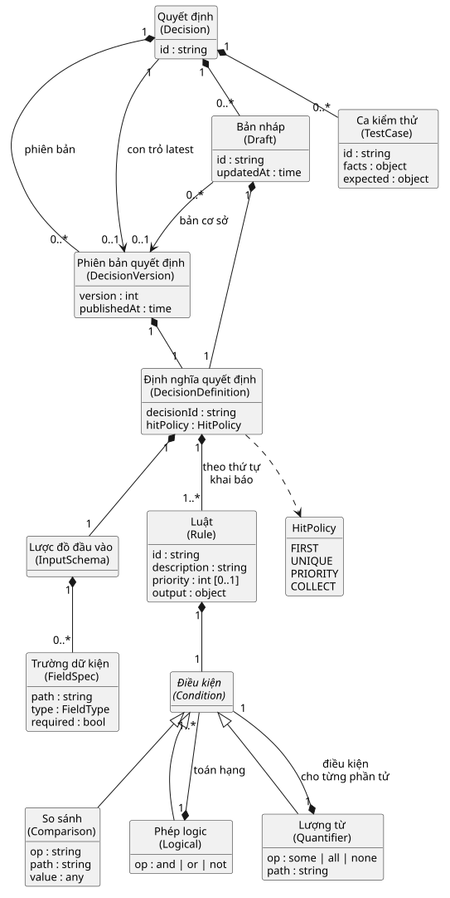
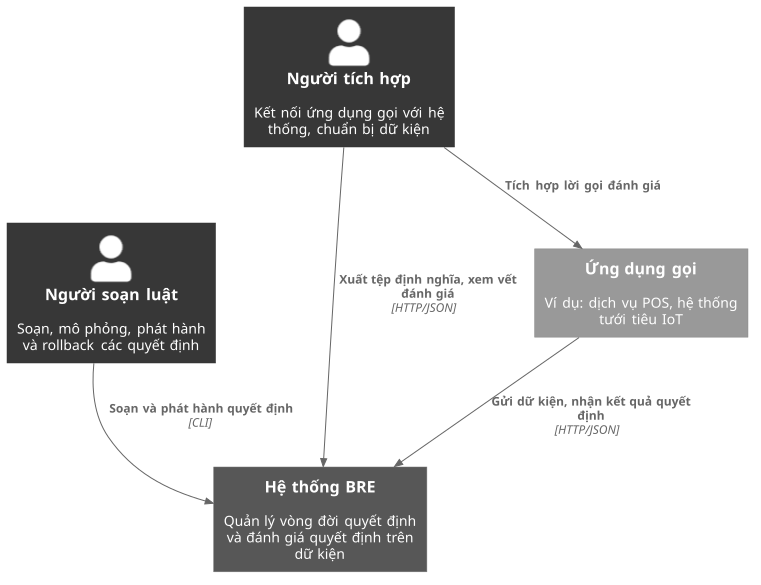
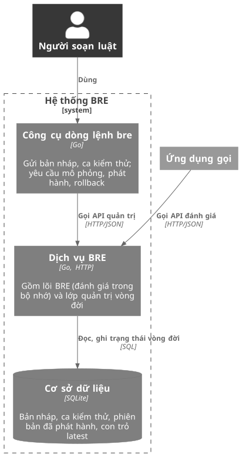
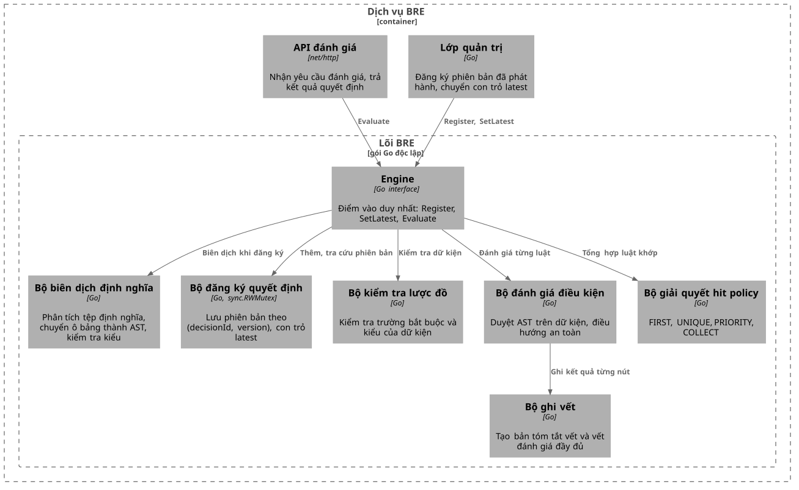
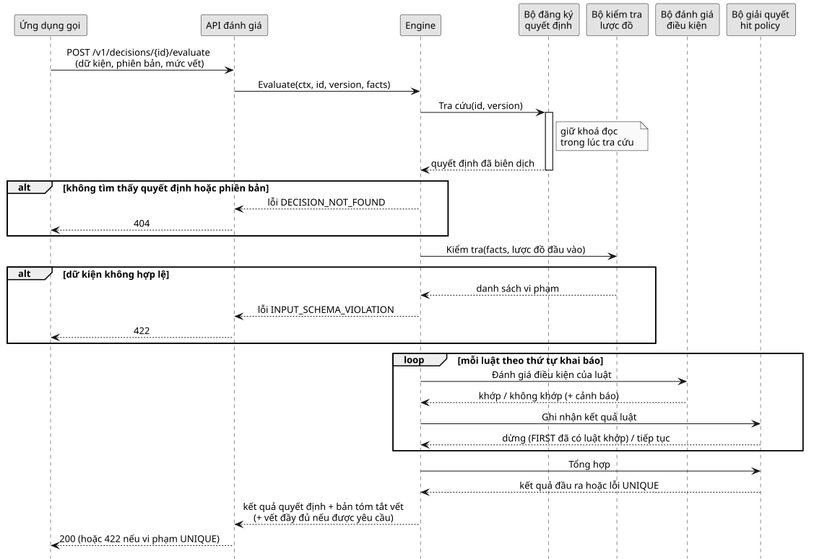
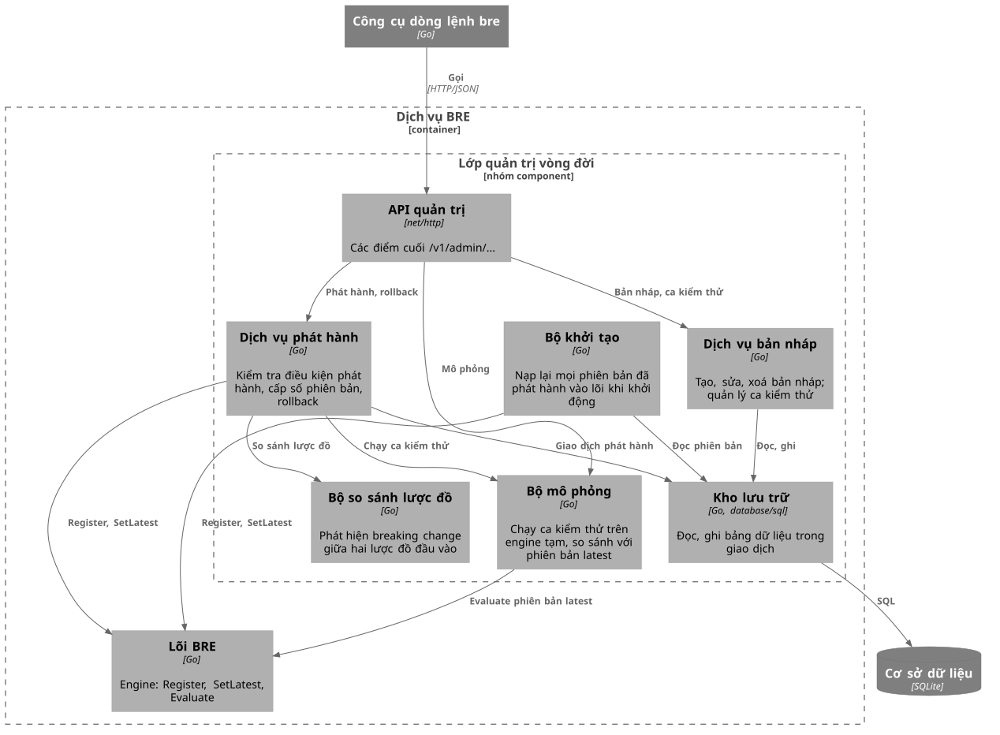
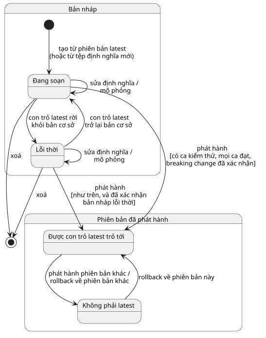
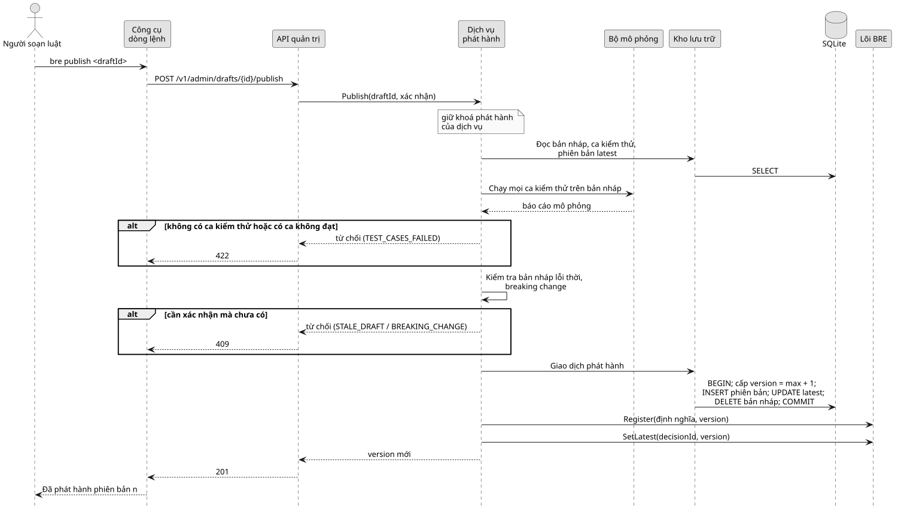

# CHƯƠNG 3. PHÂN TÍCH VÀ THIẾT KẾ HỆ THỐNG

Chương này chuyển các lựa chọn ở Chương 2 thành thiết kế cụ thể của hệ thống. Nội dung đi từ phân tích yêu cầu, qua mô hình miền và kiến trúc tổng thể theo mô hình C4, đến thiết kế chi tiết của hai phần: lõi BRE và lớp quản trị vòng đời. Cuối chương là thiết kế giao diện tích hợp gồm giao diện lập trình ứng dụng qua HTTP và công cụ dòng lệnh. Quyết định `calculate-pos-discounts` tiếp tục được dùng làm ví dụ xuyên suốt.

## 3.1. Phân tích yêu cầu

Yêu cầu của hệ thống được tổng hợp từ ba nguồn của đồ án: tài liệu yêu cầu nghiệp vụ (các mục bên liên quan, yêu cầu nghiệp vụ, quy tắc vận hành và ràng buộc), đặc tả kỹ thuật với các câu chuyện người dùng (user story), và bảng thuật ngữ miền. Mỗi yêu cầu chức năng và phi chức năng dưới đây được gán một mã để Chương 4 và Chương 5 tham chiếu khi hiện thực và kiểm chứng.

### 3.1.1. Tác nhân

Tài liệu yêu cầu nghiệp vụ xác định ba nhóm bên liên quan: người soạn luật, người tích hợp và người vận hành hạ tầng. Hai nhóm đầu trực tiếp thao tác với hệ thống và được coi là người dùng chính ngang hàng nhau. Người vận hành không có chức năng riêng trong phạm vi Phase 1; các mối quan tâm của nhóm này (ổn định, không gián đoạn khi nạp phiên bản mới) được chuyển thành yêu cầu phi chức năng ở mục 3.1.3. Ngoài con người, ứng dụng gọi là tác nhân hệ thống gửi yêu cầu đánh giá. Các tác nhân được tóm tắt trong Bảng 3.1.

**Bảng 3.1.** Các tác nhân của hệ thống

| Tác nhân | Loại | Mục tiêu | Cách tương tác |
|----------|------|----------|----------------|
| Người soạn luật | Con người | Soạn, mô phỏng, phát hành và rollback quyết định mà không cần sửa mã nguồn ứng dụng | Công cụ dòng lệnh |
| Người tích hợp | Con người | Kết nối ứng dụng gọi với hệ thống, chuẩn bị dữ kiện, giải trình các quyết định đã đưa ra | Tài liệu giao diện, giao diện lập trình ứng dụng qua HTTP |
| Ứng dụng gọi | Hệ thống | Nhận kết quả quyết định cho một tập dữ kiện, ví dụ dịch vụ bán hàng tại quầy (Point of Sale – POS) hoặc hệ thống điều khiển tưới tiêu trên nền Internet vạn vật (Internet of Things – IoT) | Giao diện lập trình ứng dụng qua HTTP |

Người tích hợp và ứng dụng gọi là hai tác nhân khác nhau: người tích hợp làm việc một lần khi kết nối, còn ứng dụng gọi gửi yêu cầu liên tục khi vận hành. Việc tách hai vai trò giúp phân biệt yêu cầu về tài liệu, khả năng giải trình (thuộc người tích hợp) với yêu cầu về độ trễ, độ ổn định (thuộc ứng dụng gọi).

### 3.1.2. Yêu cầu chức năng

Đặc tả kỹ thuật gồm 17 câu chuyện người dùng. Đồ án gộp các câu chuyện có cùng chức năng và đối chiếu với bảy yêu cầu nghiệp vụ BR-001 đến BR-007 của tài liệu yêu cầu nghiệp vụ, thu được 14 yêu cầu chức năng, mã CN-01 đến CN-14, như trong Bảng 3.2. Cột "Nguồn" ghi số thứ tự câu chuyện người dùng (US) trong đặc tả và mã yêu cầu nghiệp vụ tương ứng.

**Bảng 3.2.** Yêu cầu chức năng

| Mã | Yêu cầu | Tác nhân | Nguồn |
|----|---------|----------|-------|
| CN-01 | Định nghĩa quyết định bằng một tệp định nghĩa tự chứa (JSON hoặc YAML Ain't Markup Language – YAML), nhập và xuất được | Người soạn luật | US5; BR-001 |
| CN-02 | Soạn luật dưới dạng bảng quyết định, mỗi dòng một luật, mỗi ô một điều kiện đơn giản | Người soạn luật | US4; BR-002 |
| CN-03 | Viết điều kiện trên tập hợp bằng các lượng từ `some`, `all`, `none` | Người soạn luật | US2; BR-002 |
| CN-04 | Kiểm tra lược đồ đầu vào trước khi đánh giá: trường bắt buộc phải có và đúng kiểu | Ứng dụng gọi | BR-006 |
| CN-05 | Đánh giá quyết định với một trong bốn hit policy FIRST, UNIQUE, PRIORITY, COLLECT | Ứng dụng gọi | US1, US3, US16, US17; BR-003 |
| CN-06 | Chỉ định phiên bản cụ thể hoặc `latest` khi gọi đánh giá | Ứng dụng gọi | US11; BR-005 |
| CN-07 | Trả bản tóm tắt vết với mọi kết quả; trả vết đánh giá đầy đủ khi được yêu cầu | Người tích hợp | US12; BR-004 |
| CN-08 | Tái hiện một lần đánh giá trong quá khứ từ dữ kiện và bản tóm tắt vết | Người tích hợp | US13 |
| CN-09 | Tạo nhiều bản nháp song song cho một quyết định, mỗi bản nháp ghi nhận phiên bản cơ sở | Người soạn luật | US6 |
| CN-10 | Quản lý ca kiểm thử; mô phỏng bản nháp trên ca kiểm thử và chỉ ra dữ kiện cho kết quả khác phiên bản latest | Người soạn luật | US7 |
| CN-11 | Chỉ cho phát hành khi bản nháp có ít nhất một ca kiểm thử và mọi ca đều đạt | Người soạn luật | US8 |
| CN-12 | Cảnh báo và yêu cầu xác nhận khi phát hành bản nháp lỗi thời hoặc bản nháp có breaking change | Người soạn luật | US9 |
| CN-13 | Phát hành có hiệu lực ngay; rollback chuyển con trỏ latest về phiên bản trước mà không khởi động lại dịch vụ | Người soạn luật | US10; BR-005 |
| CN-14 | Thực hiện các thao tác vòng đời qua công cụ dòng lệnh | Người soạn luật | Đặc tả, mục quyết định hiện thực |

Hai điểm trong bảng cần giải thích. Thứ nhất, yêu cầu nghiệp vụ BR-005 ban đầu nêu việc đánh số phiên bản theo Semantic Versioning. Qua phân tích ở mục 2.5, đồ án thay bằng số nguyên tăng dần do hệ thống cấp khi phát hành, kết hợp với con trỏ latest tường minh; yêu cầu CN-06 và CN-13 được phát biểu theo cách làm đã điều chỉnh này. Thứ hai, CN-08 không đòi hỏi lưu lịch sử đánh giá phía máy chủ. Nhật ký quyết định nằm ngoài phạm vi; ứng dụng gọi tự lưu dữ kiện và bản tóm tắt vết, còn hệ thống bảo đảm rằng đánh giá lại cùng dữ kiện trên cùng phiên bản cho cùng kết quả (xem mục 3.4.4).

### 3.1.3. Yêu cầu phi chức năng

Yêu cầu phi chức năng được tổng hợp từ tiêu chí thành công, các quy tắc vận hành BRE-R01 đến BRE-R04 và các ràng buộc CON-01 đến CON-04 của tài liệu yêu cầu nghiệp vụ, cùng với quyết định kiến trúc về lưu trữ. Kết quả gồm chín yêu cầu, mã PCN-01 đến PCN-09, trình bày trong Bảng 3.3. Cột cuối nêu cách kiểm chứng ở Chương 5.

**Bảng 3.3.** Yêu cầu phi chức năng

| Mã | Yêu cầu | Nguồn | Cách kiểm chứng |
|----|---------|-------|-----------------|
| PCN-01 | Đánh giá một quyết định trong bộ nhớ dưới 1 ms | Tiêu chí thành công | Go benchmark, ngưỡng đạt/không đạt |
| PCN-02 | Không có tranh chấp dữ liệu khi đánh giá đồng thời trong lúc phát hành hoặc rollback | CON-03 | Kiểm thử đồng thời với cờ `-race` |
| PCN-03 | Không thực thi mã tuỳ ý; mọi điều kiện đi qua AST có tập toán tử đóng | CON-02 | Rà soát thiết kế; không có đường thực thi chuỗi |
| PCN-04 | Trường dữ kiện thiếu hoặc null không gây *panic* (lỗi thời gian chạy làm dừng goroutine của Go) | BR-006, BRE-R03 | Kiểm thử dữ kiện thiếu, null |
| PCN-05 | Không có thao tác vào/ra (I/O) trong quá trình đánh giá | BR-007, BRE-R04 | Rà soát phụ thuộc của gói lõi |
| PCN-06 | Không sửa đổi dữ kiện; cùng dữ kiện và cùng phiên bản luôn cho cùng kết quả | BRE-R01, BRE-R02 | Kiểm thử tái hiện |
| PCN-07 | Định nghĩa quyết định và AST tuần tự hoá được hoàn toàn sang JSON/YAML | CON-04 | Kiểm thử xuất rồi nhập lại |
| PCN-08 | Lõi là một gói Go độc lập, không phụ thuộc framework nặng | CON-01 | Rà soát phụ thuộc |
| PCN-09 | Bản nháp, ca kiểm thử, phiên bản và con trỏ latest được giữ nguyên qua các lần khởi động lại | ADR-0006 | Kiểm thử khởi động lại dịch vụ |

Các yêu cầu PCN-03, PCN-05 và PCN-08 không đo được bằng một con số mà được bảo đảm bằng cấu trúc thiết kế. Phần còn lại của chương chỉ ra cụ thể thành phần nào chịu trách nhiệm cho từng yêu cầu.

## 3.2. Mô hình miền

Mô hình miền mô tả các khái niệm của hệ thống và quan hệ giữa chúng, bám theo bảng thuật ngữ đã thống nhất. Mô hình được thể hiện bằng sơ đồ lớp UML trong Hình 3.1, trong đó mỗi lớp ghi kèm tên tiếng Anh được dùng trong mã nguồn.



**Hình 3.1.** Mô hình miền của hệ thống

Mô hình có thể đọc theo ba cụm.

**Cụm vòng đời.** Quyết định là khái niệm trung tâm, đại diện cho một câu hỏi nghiệp vụ cần câu trả lời, định danh bằng một chuỗi như `calculate-pos-discounts`. Một quyết định sở hữu nhiều phiên bản quyết định, nhiều bản nháp và nhiều ca kiểm thử. Phiên bản quyết định được định danh bằng cặp `(decisionId, version)`, trong đó `version` là số nguyên do hệ thống cấp khi phát hành. Phiên bản là bất biến: sau khi được tạo, nội dung của nó không bao giờ thay đổi. Mỗi quyết định có thêm một liên kết riêng tới không hoặc một phiên bản, đó là con trỏ latest; liên kết này tách khỏi quan hệ sở hữu, nên latest không nhất thiết là phiên bản có số lớn nhất. Bản nháp là bản sao có thể chỉnh sửa, không có số phiên bản, và ghi nhận phiên bản cơ sở mà nó được tạo ra từ đó; với quyết định mới chưa từng phát hành, phiên bản cơ sở để trống. Ca kiểm thử là cặp dữ kiện mẫu và kết quả mong đợi, thuộc về quyết định chứ không thuộc về một bản nháp, nên mọi bản nháp của cùng quyết định được kiểm thử trên cùng một bộ ca.

**Cụm định nghĩa.** Cả phiên bản và bản nháp đều chứa đúng một định nghĩa quyết định. Định nghĩa gồm *hit policy*, lược đồ đầu vào và danh sách luật có thứ tự. Thứ tự này có ý nghĩa: FIRST và COLLECT dựa vào thứ tự khai báo, còn PRIORITY dùng thứ tự khai báo để phân xử khi hai luật có cùng trọng số. Lược đồ đầu vào là danh sách trường dữ kiện, mỗi trường có đường dẫn, kiểu và cờ bắt buộc. Mỗi luật có định danh, mô tả, trọng số ưu tiên (chỉ bắt buộc với PRIORITY), một điều kiện và một kết quả đầu ra.

**Cụm điều kiện.** Điều kiện là lớp trừu tượng với ba lớp con, tạo thành cấu trúc cây theo mẫu thiết kế Composite: so sánh là nút lá, so sánh giá trị tại một đường dẫn dữ kiện với một hằng; phép logic `and`, `or`, `not` chứa một hoặc nhiều điều kiện con; lượng từ `some`, `all`, `none` chứa đường dẫn tới một danh sách và một điều kiện con được đánh giá trên từng phần tử. Đây chính là cấu trúc AST đã trình bày ở mục 2.4.

Kết quả quyết định và vết đánh giá không có trong Hình 3.1 vì chúng không được lưu trữ: đó là giá trị tạm thời do mỗi lần đánh giá sinh ra và trả về cho ứng dụng gọi. Cấu trúc của chúng được trình bày ở mục 3.4.4.

## 3.3. Kiến trúc tổng thể

Kiến trúc tổng thể được mô tả theo mô hình C4 ở hai cấp đầu: ngữ cảnh hệ thống và container. Hai sơ đồ này trả lời hai câu hỏi: hệ thống tương tác với ai, và hệ thống gồm những khối triển khai nào.

### 3.3.1. Sơ đồ ngữ cảnh hệ thống

Sơ đồ ngữ cảnh trong Hình 3.2 đặt hệ thống BRE ở trung tâm, xung quanh là ba tác nhân đã phân tích ở mục 3.1.1.



**Hình 3.2.** Sơ đồ ngữ cảnh hệ thống theo mô hình C4

Hình 3.2 cho thấy ba điểm về ranh giới của hệ thống. Thứ nhất, hệ thống không phụ thuộc vào bất kỳ hệ thống bên ngoài nào: mọi mũi tên đều đi vào hệ thống BRE, không có mũi tên nào đi ra. Đây là hệ quả trực tiếp của nguyên tắc lõi thuần trong bộ nhớ: ứng dụng gọi chịu trách nhiệm thu thập đầy đủ dữ kiện trước khi gọi, nên hệ thống không cần truy vấn cơ sở dữ liệu nghiệp vụ hay dịch vụ nào khác. Thứ hai, người tích hợp không gọi đánh giá trực tiếp mà thông qua ứng dụng gọi; người tích hợp chỉ dùng hệ thống để xuất tệp định nghĩa và xem vết đánh giá khi cần giải trình. Thứ ba, xác thực người dùng không có trong sơ đồ vì nằm ngoài phạm vi Phase 1; hệ quả của điều này đối với thiết kế giao diện được bàn ở mục 3.6.

### 3.3.2. Sơ đồ container

Phóng to vào hệ thống BRE, sơ đồ container trong Hình 3.3 cho thấy ba container: công cụ dòng lệnh (Command-Line Interface – CLI) `bre`, dịch vụ BRE và cơ sở dữ liệu SQLite.



**Hình 3.3.** Sơ đồ container theo mô hình C4

Dịch vụ BRE là một tiến trình duy nhất chứa cả lõi BRE và lớp quản trị vòng đời. Đồ án đã cân nhắc tách thành hai dịch vụ riêng, nhưng chọn gộp vì hai lý do. Một là lõi phải nhận phiên bản mới ngay khi phát hành; nếu tách, cần thêm cơ chế phân phối phiên bản giữa hai tiến trình, một bài toán mà đồ án để lại cho hướng phát triển. Hai là lõi vẫn là một gói Go độc lập trong mã nguồn, nên việc đo độ trễ được thực hiện trực tiếp trên gói này, không chịu ảnh hưởng của tầng HTTP. Theo định nghĩa của mô hình C4, các component trong cùng một container chạy chung không gian tiến trình [52]; vì vậy lõi BRE và lớp quản trị được vẽ thành hai nhóm component bên trong cùng container dịch vụ BRE ở các mục 3.4 và 3.5, không vẽ thành hai container.

Công cụ dòng lệnh là một tệp thực thi riêng, không truy cập cơ sở dữ liệu mà chỉ gọi giao diện lập trình ứng dụng (Application Programming Interface – API) quản trị của dịch vụ qua HTTP. Thiết kế này bảo đảm mọi thay đổi trạng thái vòng đời đều đi qua cùng một đường kiểm tra trong dịch vụ, và giao diện web ở Phase 2 có thể dùng lại đúng giao diện đó.

Cơ sở dữ liệu SQLite chỉ được lớp quản trị truy cập. Lõi BRE không đọc cơ sở dữ liệu trong bất kỳ trường hợp nào; dữ liệu đi vào lõi chỉ qua lời gọi đăng ký phiên bản từ lớp quản trị. Lý do chọn SQLite được trình bày ở mục 3.5.4.

## 3.4. Thiết kế lõi BRE

Lõi BRE là phần hiện thực các yêu cầu CN-01 đến CN-08 và các yêu cầu phi chức năng PCN-01 đến PCN-08. Sơ đồ component trong Hình 3.4 cho thấy cấu trúc bên trong lõi.



**Hình 3.4.** Sơ đồ component của lõi BRE theo mô hình C4

Mọi tương tác từ bên ngoài đi qua một điểm vào duy nhất là giao diện `Engine`, được khai báo trong Đoạn mã 3.1. Các component còn lại của lõi đều là chi tiết bên trong, không được dùng trực tiếp từ bên ngoài gói. Cách thiết kế này có hai lợi ích. Kiểm thử lõi chỉ cần đi qua giao diện công khai, nên cấu trúc bên trong có thể thay đổi mà không phải sửa kiểm thử. Ngoài ra, ranh giới của yêu cầu PCN-05 trở nên rõ ràng: gói lõi chỉ nhận dữ liệu qua tham số và trả dữ liệu qua giá trị trả về.

**Đoạn mã 3.1.** Giao diện công khai của lõi BRE

```go
type Engine interface {
    // Register biên dịch một định nghĩa và thêm phiên bản vào bộ đăng ký.
    // Không thay đổi con trỏ latest.
    Register(def DecisionDefinition, version int) error
    // SetLatest chuyển con trỏ latest tới một phiên bản đã đăng ký.
    SetLatest(decisionID string, version int) error
    // Evaluate đánh giá phiên bản chỉ định ("3") hoặc "latest" trên dữ kiện.
    Evaluate(ctx context.Context, decisionID, version string,
        facts map[string]any, opts EvalOptions) (*DecisionResult, error)
}
```

So với đặc tả ban đầu, giao diện có thêm phương thức `SetLatest` và tham số `opts`. `SetLatest` cần thiết vì rollback chỉ di chuyển con trỏ mà không đăng ký phiên bản mới; tách việc đăng ký khỏi việc chuyển con trỏ cũng giúp lớp quản trị nạp lại toàn bộ phiên bản khi khởi động rồi mới đặt con trỏ. Tham số `opts` mang mức vết mà ứng dụng gọi yêu cầu (mục 3.4.4).

### 3.4.1. Tệp định nghĩa quyết định

Tệp định nghĩa quyết định là đơn vị đóng gói của một quyết định: một tài liệu JSON hoặc YAML tự chứa, gồm định danh, *hit policy*, lược đồ đầu vào và danh sách luật. Định dạng này đồng thời là định dạng nhập, xuất (CN-01) và là nội dung được lưu cho mỗi bản nháp và phiên bản; trong Go, tệp được giải mã thành kiểu `DecisionDefinition` mà phương thức `Register` ở Đoạn mã 3.1 nhận vào. Đoạn mã 3.2 là tệp định nghĩa của quyết định `calculate-pos-discounts` viết bằng YAML.

**Đoạn mã 3.2.** Tệp định nghĩa của quyết định `calculate-pos-discounts`

```yaml
id: calculate-pos-discounts
hitPolicy: COLLECT
inputs:
  customer.tier: { type: string, required: true }
  cart.total:    { type: number, required: true }
  cart.items:    { type: list,   required: false }
columns: [customer.tier, cart.total]
rules:
  - { id: R1, when: ['"GOLD"', "-"], output: { code: GOLD_5PCT, type: PERCENT, value: 5 } }
  - { id: R2, when: ["-", ">= 1000000"], output: { code: BIG_CART, type: AMOUNT, value: 50000 } }
  - { id: R3, when: ['"SILVER", "GOLD"', ">= 500000"], output: { code: LOYAL_CART, type: PERCENT, value: 2 } }
  - id: R4
    description: Tặng kèm khi giỏ hàng có đồ uống
    condition:
      some: [{ var: cart.items }, { "==": [{ var: category }, BEVERAGE] }]
    output: { code: BEVERAGE_GIFT, type: GIFT, value: 1 }
```

Ba luật R1 đến R3 tương ứng với ba dòng của Bảng 2.1 và được viết dưới dạng bảng quyết định: khoá `columns` khai báo các cột, mỗi luật liệt kê các ô trong khoá `when` theo đúng thứ tự cột. Luật R4 cần điều kiện trên tập hợp, không biểu diễn được bằng một ô, nên được viết trực tiếp dưới dạng cây điều kiện trong khoá `condition`, theo cú pháp JsonLogic đã giới thiệu ở mục 2.4. Hai cách viết cùng nằm trong một danh sách `rules`, nên thứ tự luật luôn rõ ràng dù luật được viết theo cách nào. Tệp không chứa số phiên bản: số này do hệ thống cấp khi phát hành, và chỉ được thêm vào tệp khi xuất một phiên bản đã phát hành.

**Cú pháp ô.** Mỗi ô là một phép kiểm tra một ngôi trên giá trị của cột, theo cách đọc của bảng quyết định DMN [5, tr. 72]. Bảng 3.4 liệt kê các dạng ô được hỗ trợ và nút AST mà mỗi dạng được chuyển thành. Chuỗi ký tự trong ô phải đặt trong dấu nháy kép như ở Bảng 2.1, để phân biệt chuỗi `"100"` với số `100`; vì vậy trong YAML, ô chứa chuỗi được bọc thêm một lớp nháy đơn.

**Bảng 3.4.** Cú pháp ô của bảng quyết định và nút AST tương ứng

| Dạng ô | Ví dụ | Nút AST sinh ra |
|--------|-------|-----------------|
| Gạch ngang | `-` | Không sinh nút; ô luôn thoả mãn |
| Một giá trị | `"GOLD"`, `100`, `true` | `==` |
| Danh sách giá trị | `"SILVER", "GOLD"` | `in` |
| Phủ định danh sách | `not("SILVER", "GOLD")` | `not_in` |
| Toán tử và giá trị | `>= 1000000`, `!= "BANNED"` | `>=`, `>`, `<`, `<=`, `!=` tương ứng |
| Khoảng | `[500000..1000000)` | `and` của `>=` và `<`; dấu `[`, `]` là khoảng đóng, `(`, `)` là khoảng mở |

Các ô của một dòng được nối với nhau bằng phép `and`, bỏ qua các ô `-`. Như vậy, luật R3 trong Đoạn mã 3.2 được biên dịch thành cây `and(in(customer.tier, ["SILVER","GOLD"]), >=(cart.total, 500000))`. Dạng khoảng được đưa vào để quyết định phân hạng khách hàng (hit policy UNIQUE, Chương 5) viết được các khoảng chi tiêu liền kề nhau trong một ô, giúp người soạn luật kiểm soát ranh giới giữa các hạng.

**Biên dịch và kiểm tra khi nạp.** Bộ biên dịch định nghĩa chuyển tệp định nghĩa thành một quyết định đã biên dịch qua bốn bước: phân tích cú pháp JSON/YAML; kiểm tra cấu trúc (hit policy hợp lệ, định danh luật không trùng, số ô bằng số cột, luật có trọng số khi hit policy là PRIORITY); chuyển các ô thành nút AST theo Bảng 3.4; và kiểm tra kiểu. Bước kiểm tra kiểu đối chiếu mọi đường dẫn ở cấp dữ kiện với lược đồ đầu vào: đường dẫn phải được khai báo, hằng so sánh phải cùng kiểu với trường, các phép `>`, `<`, `>=`, `<=` chỉ áp dụng cho trường kiểu số, và lượng từ chỉ áp dụng cho trường kiểu danh sách. Ví dụ, ô `>= "abc"` trên cột `cart.total` bị từ chối ngay khi nạp. Đường dẫn bên trong lượng từ, như `category` trong luật R4, được tính tương đối theo phần tử danh sách và không được khai báo trong lược đồ, nên không được kiểm tra kiểu ở bước này.

Mọi lỗi được phát hiện khi nạp, trước khi phiên bản được phép đánh giá. Cách làm này chuyển một loại lỗi của luật từ thời điểm vận hành sang thời điểm soạn luật, và được dùng cho cả bản nháp: lớp quản trị từ chối lưu một bản nháp không biên dịch được (mục 3.5.1). Kết quả biên dịch là một cấu trúc bất biến; sau khi tạo, không thành phần nào sửa nó, nên nhiều goroutine có thể đọc đồng thời mà không cần khoá.

### 3.4.2. Đánh giá điều kiện

**Kiểm tra lược đồ đầu vào.** Trước khi đánh giá luật, bộ kiểm tra lược đồ đối chiếu dữ kiện với lược đồ đầu vào của phiên bản (CN-04). Trường bắt buộc mà thiếu hoặc có giá trị null, và trường có mặt nhưng sai kiểu, đều là vi phạm. Nếu có vi phạm, việc đánh giá dừng lại và trả về lỗi kèm danh sách mọi vi phạm, không chỉ vi phạm đầu tiên, để người tích hợp sửa một lần. Trường không bắt buộc được phép thiếu hoặc null. Trường không khai báo trong lược đồ bị bỏ qua; quy ước này giúp ứng dụng gọi gửi cùng một khối dữ kiện cho nhiều phiên bản mà không bị từ chối khi một phiên bản mới thôi dùng một trường. Vì đã được kiểm tra ở bước này, mọi trường khai báo có mặt trong dữ kiện đều đúng kiểu khi đi vào bộ đánh giá điều kiện.

**Bộ thông dịch duyệt cây.** Bộ đánh giá điều kiện là bộ thông dịch duyệt cây như mô tả ở mục 2.4. Mỗi nút cài đặt một phương thức đánh giá nhận dữ kiện và bộ ghi vết, trả về giá trị đúng hoặc sai. Giá trị tại một đường dẫn như `customer.tier` được lấy bằng cách đi lần lượt qua từng khoá của các đối tượng lồng nhau. Trong lượng từ, đường dẫn của điều kiện con được tính tương đối theo phần tử đang xét; Phase 1 không hỗ trợ tham chiếu ngược ra dữ kiện gốc từ bên trong lượng từ. Số trong dữ kiện JSON được giải mã thành kiểu `float64` của Go, biểu diễn chính xác mọi số nguyên tới $2^{53}$, đủ cho số tiền tính bằng đồng.

Phép `and` và `or` được đánh giá ngắn mạch: `and` dừng ở điều kiện con sai đầu tiên, `or` dừng ở điều kiện con đúng đầu tiên. Lượng từ cũng dừng sớm: `some` dừng ở phần tử thoả mãn đầu tiên, `all` và `none` dừng ở phần tử làm kết quả xác định. Các nút không được đánh giá do ngắn mạch được ghi nhận là "không đánh giá" trong vết đầy đủ. Do thứ tự đánh giá cố định, cùng dữ kiện luôn cho cùng tập nút được đánh giá và cùng vết.

**Điều hướng an toàn.** Quy tắc vận hành BRE-R03 yêu cầu dữ kiện thiếu không gây lỗi thời gian chạy. Đồ án hiện thực yêu cầu này bằng một quy tắc thống nhất: khi đường dẫn không tồn tại hoặc trỏ tới null, phép truy xuất trả về giá trị "thiếu" thay vì gây lỗi. Mọi phép so sánh có một toán hạng thiếu, kể cả `!=` và `not_in`, cho kết quả sai và ghi một cảnh báo vào vết; ngoại lệ duy nhất là so sánh tường minh với null, chẳng hạn `== null` cho kết quả đúng khi trường thiếu. Lượng từ trên một danh sách thiếu cũng cho kết quả sai, kể cả `all` và `none`, khác với danh sách rỗng, nơi `all` và `none` cho kết quả đúng theo quy ước đã nêu ở mục 2.2.2. Sự phân biệt này có chủ ý: danh sách rỗng là thông tin ("giỏ hàng không có sản phẩm nào"), còn danh sách thiếu là sự vắng mặt của thông tin, và một luật không nên khớp chỉ vì thiếu dữ liệu. Ngoài ra, phép so sánh giữa hai giá trị khác kiểu bên trong lượng từ, nơi không có kiểm tra kiểu khi nạp, cũng cho kết quả sai kèm cảnh báo.

Quy tắc này có một hệ quả mà người soạn luật cần biết: `not` đảo kết quả sai do thiếu dữ kiện thành đúng, nên `not(customer.tier == "GOLD")` đúng khi trường `customer.tier` thiếu. Đồ án giữ nguyên ngữ nghĩa logic hai giá trị của phép `not` thay vì đưa vào logic ba giá trị như FEEL, vì logic hai giá trị dễ đoán hơn với người soạn luật, và cảnh báo trong vết đầy đủ cho phép phát hiện trường hợp này khi mô phỏng. Cách viết được khuyến nghị là dùng `!=` hoặc `not_in`, vốn cho kết quả sai khi trường thiếu.

Bộ thông dịch chỉ đọc dữ kiện, không có thao tác ghi nào trên cấu trúc dữ kiện, đáp ứng quy tắc BRE-R01 về tính bất biến của dữ kiện. Bộ thông dịch cũng không gọi hàm nào ngoài các toán tử trong tập đóng, nên không tồn tại đường thực thi nào dẫn tới mã tuỳ ý (PCN-03).

### 3.4.3. Hit policy

Bộ giải quyết hit policy hiện thực ngữ nghĩa của bốn hit policy đã chọn ở mục 2.2.3. Bảng 3.5 tóm tắt hành vi của từng hit policy theo số luật khớp.

**Bảng 3.5.** Hành vi của các hit policy theo số luật khớp

| Hit policy | Không có luật khớp | Một luật khớp | Nhiều luật khớp | Duyệt hết các luật |
|------------|--------------------|---------------|-----------------|--------------------|
| FIRST | Không có đầu ra | Đầu ra của luật đó | Đầu ra của luật khớp đầu tiên | Không, dừng ở luật khớp đầu tiên |
| UNIQUE | Không có đầu ra | Đầu ra của luật đó | Lỗi `HIT_POLICY_UNIQUE_VIOLATION` | Có |
| PRIORITY | Không có đầu ra | Đầu ra của luật đó | Đầu ra của luật có trọng số lớn nhất; nếu trùng, luật khai báo trước | Có |
| COLLECT | Không có đầu ra | Danh sách một phần tử | Danh sách đầu ra theo thứ tự luật | Có |

Đoạn mã 3.3 trình bày giải thuật đánh giá một quyết định đã biên dịch. Giải thuật duyệt các luật theo thứ tự khai báo, đúng với mô hình đánh giá tuần tự một lượt ở mục 2.3.1, rồi tổng hợp các luật khớp theo hit policy.

**Đoạn mã 3.3.** Giải thuật đánh giá một quyết định đã biên dịch

```go
func (d *compiledDecision) evaluate(facts map[string]any, rec Recorder) (any, error) {
    var matched []*rule
    for _, r := range d.rules { // theo thứ tự khai báo
        if !r.cond.Eval(facts, rec) {
            continue
        }
        matched = append(matched, r)
        if d.hitPolicy == First {
            break // FIRST: không cần đánh giá các luật sau
        }
    }
    switch {
    case len(matched) == 0:
        return nil, nil // không có đầu ra, không phải lỗi
    case d.hitPolicy == Unique && len(matched) > 1:
        return nil, uniqueViolation(matched)
    case d.hitPolicy == Priority:
        return highestPriority(matched).output, nil // trùng trọng số: luật đứng trước
    case d.hitPolicy == Collect:
        return outputsOf(matched), nil // danh sách theo thứ tự luật
    }
    return matched[0].output, nil // FIRST, UNIQUE
}
```

Với UNIQUE, giải thuật phải đánh giá mọi luật mới biết có nhiều hơn một luật khớp hay không. Lỗi vi phạm liệt kê định danh của mọi luật cùng khớp, giúp người soạn luật thấy ngay hai khoảng nào đang chồng lấn. Lỗi này được trả cho ứng dụng gọi như một lỗi đánh giá chứ không phải một kết quả, vì với dữ kiện đó quyết định không có câu trả lời hợp lệ. Mô phỏng (mục 3.5.2) là nơi phát hiện lỗi này trước khi phát hành, nếu bộ ca kiểm thử có dữ kiện rơi vào vùng chồng lấn.

Với PRIORITY, quy tắc phân xử khi trùng trọng số theo thứ tự khai báo bảo đảm luôn chọn được đúng một luật, nên kết quả mang tính xác định. Với COLLECT, đầu ra luôn là danh sách theo thứ tự luật và không có phép gộp; áp dụng cho Bảng 2.1 và dữ kiện ở mục 2.2.2, kết quả là danh sách ba chiết khấu `GOLD_5PCT`, `BIG_CART`, `LOYAL_CART`. Trường hợp không có luật khớp cho kết quả không có đầu ra với mọi hit policy, kể cả COLLECT, để ứng dụng gọi xử lý thống nhất một trường hợp duy nhất: danh sách luật khớp trong bản tóm tắt vết rỗng.

### 3.4.4. Vết đánh giá

Vết đánh giá phục vụ yêu cầu giải trình (CN-07, CN-08). Đồ án thiết kế vết ở hai mức. Bản tóm tắt vết luôn được trả kèm kết quả quyết định; vết đánh giá đầy đủ chỉ được tạo khi ứng dụng gọi yêu cầu, và luôn được tạo khi mô phỏng. Thông tin ở mỗi mức được so sánh trong Bảng 3.6.

**Bảng 3.6.** Thông tin trong bản tóm tắt vết và vết đánh giá đầy đủ

| Thông tin | Bản tóm tắt vết | Vết đầy đủ |
|-----------|:---------------:|:----------:|
| Định danh quyết định và số phiên bản đã đánh giá | Có | Có |
| Định danh các luật khớp | Có | Có |
| Định danh các luật được chọn theo hit policy | Có | Có |
| Thời gian thực thi | Có | Có |
| Bản chụp dữ kiện đầu vào | Không | Có |
| Kết quả từng nút điều kiện: đúng, sai hoặc không đánh giá | Không | Có |
| Lý do chọn hoặc loại từng luật theo hit policy | Không | Có |
| Cảnh báo về trường thiếu, null hoặc khác kiểu | Không | Có |
| Thời điểm bắt đầu, kết thúc và phiên bản của engine | Không | Có |

Lý do chia hai mức là chi phí. Vết đầy đủ ghi một bản ghi cho mỗi nút điều kiện được đánh giá và một bản sao của dữ kiện, nên tốn bộ nhớ tỷ lệ với kích thước tập luật và dữ kiện. Bản tóm tắt chỉ gồm vài định danh và một số đo thời gian. Trong thiết kế, bộ đánh giá điều kiện nhận một đối tượng ghi vết qua giao diện `Recorder` (Đoạn mã 3.3); ở mức tóm tắt, đối tượng này bỏ qua mọi bản ghi cấp nút, nên lần đánh giá thông thường gần như không tốn thêm chi phí cho vết.

**Tái hiện.** Bản tóm tắt vết chứa đủ thông tin để tái hiện vết đầy đủ. Từ dữ kiện đã lưu và số phiên bản ghi trong bản tóm tắt, người tích hợp gọi đánh giá lại với đúng số phiên bản đó và yêu cầu vết đầy đủ. Kết quả thu được trùng với lần đánh giá ban đầu nhờ ba tính chất đã thiết kế: phiên bản đã phát hành là bất biến và không bao giờ bị xoá, kể cả sau rollback; việc đánh giá chỉ phụ thuộc vào dữ kiện và phiên bản (PCN-06); và không điều kiện nào phụ thuộc vào thời điểm đánh giá. Chỉ các trường thời gian trong vết là khác nhau giữa hai lần. Việc tái hiện vì vậy không cần một điểm cuối riêng; nó là một lời gọi đánh giá thông thường với số phiên bản cụ thể. Tính chất này giả định ngữ nghĩa của engine không đổi giữa hai lần đánh giá, nên vết đầy đủ ghi kèm phiên bản của engine để đối chiếu.

### 3.4.5. Bộ đăng ký quyết định

Bộ đăng ký quyết định là danh mục trong bộ nhớ của các phiên bản đã phát hành. Cấu trúc dữ liệu gồm một bảng băm từ định danh quyết định tới một mục, mỗi mục gồm một bảng băm từ số phiên bản tới quyết định đã biên dịch và số phiên bản mà con trỏ latest đang trỏ tới. Tra cứu với tham số `latest` đọc con trỏ trước rồi tra bảng phiên bản; tra cứu với số cụ thể tra thẳng bảng phiên bản. Vì `latest` là một con trỏ tường minh, rollback chỉ cần đổi một số nguyên mà không động tới các phiên bản.

**Lựa chọn cơ chế đồng bộ.** Mục 2.6 đã nêu hai phương án đồng bộ cho bộ đăng ký: khoá đọc-ghi `sync.RWMutex` và tráo con trỏ nguyên tử bằng `atomic.Pointer` theo kiểu sao chép khi ghi (copy-on-write). Đồ án chọn `sync.RWMutex` vì ba lý do.

Thứ nhất, thời gian giữ khoá rất ngắn. Lời gọi đánh giá chỉ giữ khoá đọc trong lúc tra cứu, lấy ra con trỏ tới quyết định đã biên dịch, rồi nhả khoá trước khi đánh giá luật. Điều này an toàn vì quyết định đã biên dịch là bất biến (mục 3.4.1): sau khi nhả khoá, việc đọc nó không còn tranh chấp với bất kỳ thao tác ghi nào. Do đó, thao tác ghi chỉ phải chờ các lần tra cứu bảng băm đang diễn ra chứ không phải chờ các lần đánh giá. Đây cũng là lý do lợi thế chính của `atomic.Pointer`, tức người đọc không bao giờ phải chờ, không đáng kể trong trường hợp này.

Thứ hai, thao tác ghi cần cập nhật nhiều phần của cấu trúc cùng lúc. Khi khởi động, lớp quản trị đăng ký hàng loạt phiên bản; với `atomic.Pointer`, mỗi lần ghi phải sao chép toàn bộ bảng băm rồi tráo con trỏ, và hai thao tác ghi đồng thời có thể làm mất cập nhật của nhau nếu không có thêm một khoá ghi. Với `RWMutex`, mọi thao tác ghi đơn giản là sửa tại chỗ dưới khoá ghi.

Thứ ba, `RWMutex` bảo đảm người ghi không bị bỏ đói: khi có goroutine chờ khoá ghi, các yêu cầu khoá đọc mới phải chờ [44]. Phát hành và rollback vì vậy có hiệu lực ngay cả khi tải đánh giá cao. Lựa chọn này cũng phù hợp với khuyến nghị chỉ dùng các hàm nguyên tử cho ứng dụng cấp thấp đặc biệt [45].

Sơ đồ tuần tự trong Hình 3.5 thể hiện toàn bộ luồng đánh giá một quyết định, từ khi ứng dụng gọi gửi yêu cầu tới khi nhận kết quả, bao gồm vị trí giữ khoá đọc của bộ đăng ký.



**Hình 3.5.** Sơ đồ tuần tự của luồng đánh giá một quyết định

Theo Hình 3.5, một lần đánh giá có ba điểm dừng sớm: không tìm thấy quyết định hoặc phiên bản, dữ kiện vi phạm lược đồ, và vi phạm UNIQUE. Trong vòng lặp, bộ giải quyết hit policy được hỏi sau mỗi luật để quyết định có dừng hay không, cho phép FIRST kết thúc ngay khi gặp luật khớp đầu tiên. Toàn bộ luồng sau bước tra cứu chỉ làm việc trên bộ nhớ của goroutine đang xử lý và trên quyết định đã biên dịch bất biến, nên các yêu cầu đánh giá đồng thời không cần đồng bộ với nhau (PCN-02).

## 3.5. Thiết kế lớp quản trị vòng đời

Lớp quản trị hiện thực các yêu cầu về vòng đời CN-09 đến CN-14 và yêu cầu lưu trữ bền vững PCN-09. Lớp này là phần duy nhất của dịch vụ có trạng thái lưu trên đĩa. Sơ đồ component trong Hình 3.6 cho thấy cấu trúc của lớp quản trị và cách nó dùng lõi BRE.



**Hình 3.6.** Sơ đồ component của lớp quản trị vòng đời theo mô hình C4

Lớp quản trị gồm bảy component. API quản trị tiếp nhận các yêu cầu từ công cụ dòng lệnh và chuyển tới ba component nghiệp vụ: dịch vụ bản nháp, bộ mô phỏng và dịch vụ phát hành. Kho lưu trữ là component duy nhất truy cập SQLite. Bộ so sánh lược đồ phát hiện breaking change. Bộ khởi tạo chạy một lần khi dịch vụ khởi động: nó đọc mọi phiên bản đã phát hành từ cơ sở dữ liệu, đăng ký lần lượt vào lõi, rồi đặt con trỏ latest cho từng quyết định. Nhờ đó, cơ sở dữ liệu là nguồn dữ liệu gốc, còn bộ đăng ký trong lõi là bản sao trong bộ nhớ có thể dựng lại bất cứ lúc nào.

### 3.5.1. Bản nháp và ca kiểm thử

**Bản nháp.** Bản nháp được tạo theo một trong hai cách: sao chép định nghĩa của phiên bản đang được con trỏ latest trỏ tới, khi đó phiên bản cơ sở là phiên bản đó; hoặc từ một tệp định nghĩa do người soạn luật cung cấp, dùng cho quyết định mới hoặc khi nhập từ kho Git. Một quyết định có thể có nhiều bản nháp cùng lúc (CN-09), để một bản sửa khẩn cấp không phải chờ một thay đổi lớn đang soạn dở. Mỗi lần lưu, bản nháp được biên dịch bằng chính bộ biên dịch của lõi (mục 3.4.1); bản nháp không biên dịch được bị từ chối kèm danh sách lỗi. Vì người soạn luật làm việc trên tệp cục bộ và gửi lên qua công cụ dòng lệnh, việc từ chối không làm mất nội dung đang soạn.

**Ca kiểm thử.** Mỗi ca kiểm thử gồm tên, dữ kiện mẫu và kết quả mong đợi. Kết quả mong đợi là đầu ra của quyết định, hoặc một mã lỗi khi người soạn luật muốn khẳng định rằng dữ kiện đó phải bị từ chối, ví dụ lỗi vi phạm UNIQUE hay vi phạm lược đồ. Một ca đạt khi kết quả đánh giá bản nháp bằng kết quả mong đợi. Phép so sánh được thực hiện trên giá trị đã giải mã chứ không trên chuỗi JSON, nên thứ tự khoá trong đối tượng không ảnh hưởng tới kết quả; riêng với COLLECT, thứ tự phần tử trong danh sách có ý nghĩa và được so sánh. Ca kiểm thử thuộc về quyết định, nên khi người soạn luật cố ý thay đổi chính sách, các ca có kết quả mong đợi theo chính sách cũ cũng phải được cập nhật. Đây là hành vi mong muốn: việc cập nhật ca kiểm thử buộc người soạn luật khẳng định lại tường minh hành vi mới.

**Vòng đời.** Sơ đồ trạng thái trong Hình 3.7 thể hiện vòng đời của bản nháp và của phiên bản quyết định.



**Hình 3.7.** Sơ đồ trạng thái của bản nháp và phiên bản quyết định

Bản nháp có hai trạng thái: đang soạn và lỗi thời. Bản nháp trở thành lỗi thời khi con trỏ latest rời khỏi phiên bản cơ sở của nó, do một bản nháp khác được phát hành hoặc do rollback. Trạng thái này không được lưu mà được suy ra mỗi khi cần, bằng cách so sánh phiên bản cơ sở với con trỏ latest hiện tại; vì vậy, nếu con trỏ quay lại đúng phiên bản cơ sở, bản nháp tự động trở lại trạng thái đang soạn. Khi phát hành, bản nháp kết thúc vòng đời và trở thành một phiên bản mới, được con trỏ latest trỏ tới. Hệ thống không tự động gộp thay đổi giữa các bản nháp; với bản nháp lỗi thời, người soạn luật phải xác nhận rằng mình biết có phiên bản mới hơn.

Phiên bản đã phát hành cũng có hai trạng thái: được con trỏ latest trỏ tới hoặc không. Hai trạng thái này chỉ khác nhau ở việc ứng dụng gọi dùng `latest` có nhận phiên bản đó hay không; ở cả hai trạng thái, phiên bản vẫn đánh giá được theo số phiên bản cụ thể. Phiên bản không có trạng thái kết thúc vì không bao giờ bị xoá, điều kiện cần cho việc tái hiện ở mục 3.4.4.

### 3.5.2. Mô phỏng

Mô phỏng đánh giá một bản nháp trên dữ kiện mẫu mà không làm thay đổi bất kỳ phiên bản đã phát hành nào (CN-10). Đầu vào gồm bản nháp, bộ ca kiểm thử của quyết định và, tuỳ chọn, một danh sách dữ kiện bổ sung do người soạn luật cung cấp. Mô phỏng thực hiện hai việc.

**Chạy ca kiểm thử.** Mỗi ca kiểm thử được đánh giá trên bản nháp với vết đầy đủ, rồi so sánh với kết quả mong đợi. Báo cáo ghi rõ ca nào đạt, ca nào không đạt, kèm kết quả thực tế và vết đầy đủ của ca không đạt để người soạn luật thấy điều kiện nào gây ra khác biệt.

**So sánh với phiên bản latest.** Mỗi tập dữ kiện, gồm dữ kiện của các ca kiểm thử và dữ kiện bổ sung, được đánh giá trên cả bản nháp và phiên bản latest. Báo cáo liệt kê các tập dữ kiện cho kết quả khác nhau giữa hai bên, kèm kết quả của mỗi bên. Đây là thông tin trả lời câu hỏi "thay đổi này ảnh hưởng tới những trường hợp nào", bổ sung cho câu hỏi "thay đổi này có đúng không" mà ca kiểm thử trả lời. Nếu dữ kiện hợp lệ với phiên bản latest nhưng bị bản nháp từ chối do vi phạm lược đồ, khác biệt đó cũng được báo cáo, như một dấu hiệu sớm của breaking change. Khi quyết định chưa có phiên bản nào, bước so sánh được bỏ qua.

**Cô lập.** Bản nháp không được đăng ký vào bộ đăng ký của dịch vụ. Thay vào đó, bộ mô phỏng tạo một thể hiện `Engine` tạm thời cho mỗi lần mô phỏng, đăng ký bản nháp vào đó với số phiên bản quy ước là 0, đánh giá, rồi bỏ thể hiện này. Phiên bản latest được đánh giá qua engine chính của dịch vụ như mọi lời gọi khác. Thiết kế này dùng lại đúng giao diện công khai của lõi, không cần thêm phương thức riêng cho mô phỏng, và bảo đảm về mặt cấu trúc rằng mô phỏng không thể làm thay đổi bộ đăng ký mà ứng dụng gọi đang dùng. Chi phí tạo một engine tạm là nhỏ, vì engine chỉ là một cấu trúc trong bộ nhớ.

### 3.5.3. Phát hành và rollback

**Phát hành.** Phát hành biến một bản nháp thành một phiên bản mới và chuyển con trỏ latest tới phiên bản đó (CN-11 đến CN-13). Sơ đồ tuần tự trong Hình 3.8 thể hiện luồng phát hành.



**Hình 3.8.** Sơ đồ tuần tự của luồng phát hành

Theo Hình 3.8, dịch vụ phát hành kiểm tra ba điều kiện theo thứ tự trước khi ghi bất cứ gì.

1. **Ca kiểm thử.** Dịch vụ phát hành tự chạy lại mọi ca kiểm thử trên bản nháp thông qua bộ mô phỏng, thay vì dựa vào kết quả của một lần mô phỏng trước đó, vì bản nháp hoặc ca kiểm thử có thể đã thay đổi kể từ lần đó. Nếu quyết định không có ca kiểm thử nào, hoặc có ca không đạt, yêu cầu bị từ chối.
2. **Bản nháp lỗi thời.** Nếu phiên bản cơ sở của bản nháp khác phiên bản latest, yêu cầu bị từ chối trừ khi người soạn luật đã xác nhận. Thông báo từ chối nêu số phiên bản mới hơn để người soạn luật xem lại.
3. **Breaking change.** Bộ so sánh lược đồ đối chiếu lược đồ đầu vào của bản nháp với lược đồ của phiên bản latest. Ba thay đổi được coi là breaking change, vì chúng làm dữ kiện đang được chấp nhận bị từ chối: thêm một trường bắt buộc mới, chuyển một trường từ không bắt buộc sang bắt buộc, và đổi kiểu của một trường. Các thay đổi còn lại không phá vỡ tương thích: thêm trường không bắt buộc, chuyển trường bắt buộc thành không bắt buộc, và bỏ một trường, vì trường không khai báo bị bỏ qua khi kiểm tra lược đồ (mục 3.4.2). Nếu có breaking change, yêu cầu bị từ chối trừ khi người soạn luật đã xác nhận.

Khi cả ba điều kiện thoả mãn, dịch vụ phát hành ghi vào cơ sở dữ liệu trong một giao dịch (transaction) duy nhất: cấp số phiên bản bằng số lớn nhất hiện có cộng một, thêm bản ghi phiên bản, cập nhật con trỏ latest và xoá bản nháp. Sau khi giao dịch thành công, dịch vụ gọi `Register` rồi `SetLatest` trên lõi. Thứ tự ghi cơ sở dữ liệu trước, cập nhật lõi sau là có chủ ý. Nếu giao dịch thất bại, lõi chưa bị thay đổi nên trạng thái hai bên vẫn khớp nhau. Nếu tiến trình dừng đột ngột sau khi giao dịch hoàn tất nhưng trước khi lõi được cập nhật, bộ khởi tạo sẽ nạp lại phiên bản mới từ cơ sở dữ liệu ở lần khởi động sau. Bước đăng ký vào lõi không thể thất bại do lỗi định nghĩa, vì bản nháp đã được biên dịch thành công trước đó.

Giữa hai lời gọi `Register` và `SetLatest`, phiên bản mới đã có trong bộ đăng ký nhưng con trỏ latest chưa đổi. Ứng dụng gọi dùng `latest` trong khoảng thời gian này nhận phiên bản cũ, và từ sau `SetLatest` nhận phiên bản mới; không có thời điểm nào ứng dụng gọi nhận được trạng thái dở dang. Với ứng dụng gọi, việc chuyển phiên bản vì vậy là nguyên tử.

Hai yêu cầu phát hành đồng thời cho cùng một quyết định có thể cấp trùng số phiên bản hoặc cập nhật lõi theo thứ tự khác với cơ sở dữ liệu. Để tránh điều này, dịch vụ phát hành giữ một khoá trong suốt luồng phát hành, từ bước kiểm tra tới khi cập nhật xong lõi. Khoá này chỉ tuần tự hoá các thao tác phát hành và rollback với nhau, không ảnh hưởng tới các lời gọi đánh giá. Do thao tác phát hành hiếm và nhanh, việc tuần tự hoá không làm giảm khả năng sử dụng.

**Rollback.** Rollback nhận định danh quyết định và một số phiên bản đích. Phiên bản đích phải đã được phát hành và khác phiên bản latest hiện tại. Dịch vụ phát hành cập nhật con trỏ latest trong cơ sở dữ liệu, rồi gọi `SetLatest` trên lõi, dưới cùng khoá với phát hành. Không phiên bản nào bị xoá hay tạo mới. Rollback có thể đưa con trỏ về bất kỳ phiên bản đã phát hành nào, kể cả về một phiên bản mới hơn sau khi đã rollback, nên thao tác này cũng dùng để "tiến lại" khi sự cố đã được làm rõ.

### 3.5.4. Lưu trữ dữ liệu

Trạng thái vòng đời được lưu trong SQLite, theo quyết định kiến trúc ADR-0006. Hai phương án khác đã được cân nhắc. Lưu trực tiếp các tệp định nghĩa trong hệ thống tệp hoặc kho Git phù hợp với định dạng tệp tự chứa, nhưng không bảo đảm được việc thêm phiên bản và chuyển con trỏ latest diễn ra nguyên tử. PostgreSQL bảo đảm được điều đó nhưng đòi hỏi thêm một máy chủ cơ sở dữ liệu, không mang lại lợi ích ở quy mô của đề tài. SQLite là thư viện chạy trong tiến trình dịch vụ, lưu toàn bộ dữ liệu trong một tệp, và cung cấp giao dịch có tính nguyên tử, nhất quán, cô lập và bền vững; theo tài liệu của SQLite, mọi thay đổi trong một giao dịch hoặc được thực hiện toàn bộ hoặc không được thực hiện, kể cả khi chương trình, hệ điều hành bị lỗi hoặc mất điện giữa chừng [57]. Tính chất này là cơ sở cho thứ tự ghi ở mục 3.5.3. Cấu trúc các bảng được trình bày trong Bảng 3.7.

**Bảng 3.7.** Cấu trúc cơ sở dữ liệu của lớp quản trị

| Bảng | Cột | Ràng buộc và ghi chú |
|------|-----|----------------------|
| `decisions` | `id`, `latest_version`, `created_at` | Khoá chính `id`. `latest_version` là con trỏ latest, để trống khi chưa có phiên bản; cùng với `id` tham chiếu tới `decision_versions` |
| `decision_versions` | `decision_id`, `version`, `artifact`, `published_at` | Khoá chính `(decision_id, version)`. `artifact` là tệp định nghĩa dạng JSON chuẩn hoá. Không cho phép cập nhật, xoá |
| `drafts` | `id`, `decision_id`, `base_version`, `artifact`, `created_at`, `updated_at` | `base_version` là phiên bản cơ sở, để trống với quyết định mới |
| `test_cases` | `id`, `decision_id`, `name`, `facts`, `expected` | `facts`, `expected` lưu dạng JSON; thuộc về quyết định, không thuộc bản nháp |

Bảng `decision_versions` lưu mỗi phiên bản dưới dạng nguyên một tệp định nghĩa thay vì tách luật thành nhiều bảng. Cách lưu này phản ánh đúng bản chất của phiên bản: một đơn vị bất biến được đọc và ghi nguyên khối, không bao giờ được truy vấn theo từng luật. Nó cũng giữ cho định dạng lưu trữ trùng với định dạng nhập, xuất, nên xuất một phiên bản chỉ là đọc ra đúng nội dung đã lưu. Tính bất biến được bảo đảm ở hai tầng: kho lưu trữ không có thao tác cập nhật hay xoá cho bảng này, và cơ sở dữ liệu có trình kích hoạt (trigger) từ chối mọi câu lệnh cập nhật hoặc xoá trên bảng, phòng trường hợp lỗi lập trình ở tầng trên.

Nếu SQLite ghi bị lỗi khi đang có yêu cầu đánh giá, các lời gọi đánh giá không bị ảnh hưởng, vì chúng chỉ đọc bộ đăng ký trong bộ nhớ. Lõi tiếp tục phục vụ các phiên bản đã nạp ngay cả khi cơ sở dữ liệu tạm thời không truy cập được; chỉ các thao tác vòng đời bị gián đoạn.

## 3.6. Thiết kế giao diện tích hợp

Hệ thống có hai giao diện tích hợp: API qua HTTP, dùng dữ liệu JSON, và CLI. API được chia thành hai nhóm theo tiền tố đường dẫn: nhóm đánh giá dành cho ứng dụng gọi, và nhóm quản trị với tiền tố `/v1/admin` dành cho CLI. Vì xác thực nằm ngoài phạm vi Phase 1, việc tách tiền tố cho phép người vận hành giới hạn truy cập nhóm quản trị ở tầng mạng, chẳng hạn chỉ mở `/v1/admin` cho mạng nội bộ qua một *reverse proxy* (máy chủ trung gian chuyển tiếp yêu cầu tới dịch vụ), mà không phải sửa dịch vụ. Tiền tố phiên bản `/v1` dành chỗ cho các thay đổi không tương thích của API về sau. Các điểm cuối (endpoint) của API được liệt kê trong Bảng 3.8.

**Bảng 3.8.** Các điểm cuối của API

| Phương thức | Đường dẫn | Chức năng | Yêu cầu |
|-------------|-----------|-----------|---------|
| POST | `/v1/decisions/{id}/evaluate` | Đánh giá quyết định; tái hiện khi chỉ định số phiên bản và vết đầy đủ | CN-04 đến CN-08 |
| GET | `/v1/admin/decisions` | Liệt kê quyết định và phiên bản latest | CN-13 |
| GET | `/v1/admin/decisions/{id}/versions/{version}` | Xuất tệp định nghĩa của một phiên bản | CN-01 |
| POST | `/v1/admin/decisions/{id}/drafts` | Tạo bản nháp từ phiên bản latest hoặc từ tệp định nghĩa | CN-01, CN-09 |
| GET, PUT, DELETE | `/v1/admin/drafts/{draftId}` | Xem, cập nhật, xoá bản nháp | CN-09 |
| GET, POST | `/v1/admin/decisions/{id}/test-cases` | Liệt kê, thêm ca kiểm thử | CN-10 |
| PUT, DELETE | `/v1/admin/decisions/{id}/test-cases/{caseId}` | Sửa, xoá ca kiểm thử | CN-10 |
| POST | `/v1/admin/drafts/{draftId}/simulate` | Mô phỏng bản nháp | CN-10 |
| POST | `/v1/admin/drafts/{draftId}/publish` | Phát hành bản nháp, kèm các xác nhận nếu có | CN-11, CN-12, CN-13 |
| POST | `/v1/admin/decisions/{id}/rollback` | Chuyển con trỏ latest về một phiên bản | CN-13 |

**Đánh giá.** Đoạn mã 3.4 là một yêu cầu đánh giá quyết định `calculate-pos-discounts`. Thân yêu cầu gồm phiên bản (`"latest"` hoặc một số), mức vết (`"summary"` hoặc `"full"`) và dữ kiện. Phiên bản và mức vết được đặt trong thân yêu cầu thay vì trên đường dẫn, để mọi lời gọi đánh giá dùng chung một điểm cuối.

**Đoạn mã 3.4.** Yêu cầu đánh giá quyết định `calculate-pos-discounts`

```json
{
  "version": "latest",
  "trace": "summary",
  "facts": {
    "customer": { "tier": "GOLD" },
    "cart": {
      "total": 1200000,
      "items": [
        { "sku": "TRA-XANH-500", "category": "BEVERAGE" },
        { "sku": "BANH-QUY-200", "category": "SNACK" }
      ]
    }
  }
}
```

Với dữ kiện trong Đoạn mã 3.4, cả bốn luật của Đoạn mã 3.2 đều khớp. Kết quả trả về được minh hoạ trong Đoạn mã 3.5; các giá trị số phiên bản và thời gian thực thi chỉ mang tính minh hoạ. Kết quả gồm đầu ra theo hit policy COLLECT và bản tóm tắt vết, trong đó số phiên bản thực tế được trả về kể cả khi yêu cầu dùng `latest`, để ứng dụng gọi lưu lại phục vụ việc tái hiện.

**Đoạn mã 3.5.** Kết quả đánh giá tương ứng với Đoạn mã 3.4 (giá trị minh hoạ)

```json
{
  "decisionId": "calculate-pos-discounts",
  "version": 3,
  "output": [
    { "code": "GOLD_5PCT", "type": "PERCENT", "value": 5 },
    { "code": "BIG_CART", "type": "AMOUNT", "value": 50000 },
    { "code": "LOYAL_CART", "type": "PERCENT", "value": 2 },
    { "code": "BEVERAGE_GIFT", "type": "GIFT", "value": 1 }
  ],
  "summary": {
    "version": 3,
    "matchedRules": ["R1", "R2", "R3", "R4"],
    "selectedRules": ["R1", "R2", "R3", "R4"],
    "durationMicros": 18
  }
}
```

**Mã lỗi.** Mọi lỗi được trả về dưới cùng một cấu trúc gồm mã lỗi dạng chuỗi, thông điệp và chi tiết. Mã trạng thái HTTP được chọn theo ngữ nghĩa của RFC 9110. Mã 400 dành cho yêu cầu mà máy chủ không xử lý do lỗi phía người gửi, như cú pháp sai [58, mục 15.5.1]. Mã 422 dành cho yêu cầu có định dạng và cú pháp đúng nhưng máy chủ không thể thực hiện các chỉ thị trong đó [58, mục 15.5.21], phù hợp với dữ kiện vi phạm lược đồ hay bản nháp có ca kiểm thử không đạt. Mã 409 dành cho xung đột với trạng thái hiện tại của tài nguyên, trong tình huống người dùng có thể giải quyết xung đột rồi gửi lại yêu cầu; RFC 9110 còn yêu cầu nội dung phản hồi cung cấp đủ thông tin để người dùng nhận ra nguồn gốc xung đột [58, mục 15.5.10]. Ngữ nghĩa này khớp với bản nháp lỗi thời và breaking change: người soạn luật xem thông tin trong phản hồi, rồi gửi lại yêu cầu kèm xác nhận. Bảng 3.9 liệt kê các mã lỗi chính.

**Bảng 3.9.** Các mã lỗi chính của API

| Mã lỗi | Mã HTTP | Tình huống |
|--------|---------|------------|
| `INVALID_REQUEST` | 400 | Thân yêu cầu không phải JSON hợp lệ hoặc thiếu trường bắt buộc của API |
| `DECISION_NOT_FOUND` | 404 | Không có quyết định hoặc phiên bản được yêu cầu, hoặc quyết định chưa có phiên bản latest |
| `INPUT_SCHEMA_VIOLATION` | 422 | Dữ kiện vi phạm lược đồ đầu vào; chi tiết gồm mọi vi phạm |
| `HIT_POLICY_UNIQUE_VIOLATION` | 422 | Nhiều luật cùng khớp với hit policy UNIQUE; chi tiết gồm các luật khớp |
| `INVALID_DEFINITION` | 422 | Tệp định nghĩa không biên dịch được; chi tiết gồm vị trí và nội dung lỗi |
| `TEST_CASES_FAILED` | 422 | Phát hành khi không có ca kiểm thử hoặc có ca không đạt |
| `STALE_DRAFT` | 409 | Phát hành bản nháp lỗi thời khi chưa xác nhận; chi tiết gồm phiên bản latest hiện tại |
| `BREAKING_CHANGE` | 409 | Phát hành bản nháp có breaking change khi chưa xác nhận; chi tiết gồm các trường thay đổi |

Lỗi vi phạm UNIQUE dùng mã 422 vì yêu cầu hợp lệ về cú pháp nhưng quyết định không thể đưa ra một kết quả duy nhất cho dữ kiện đó. Ứng dụng gọi phân biệt được lỗi này với lỗi dữ kiện nhờ mã lỗi dạng chuỗi.

**Công cụ dòng lệnh.** CLI là lớp mỏng trên API quản trị: mỗi lệnh đọc tệp cục bộ nếu cần, gửi một hoặc vài yêu cầu HTTP, rồi in kết quả dưới dạng dễ đọc. Địa chỉ dịch vụ được đọc từ biến môi trường hoặc cờ dòng lệnh. Các lệnh được liệt kê trong Bảng 3.10.

**Bảng 3.10.** Các lệnh của công cụ dòng lệnh `bre`

| Lệnh | Chức năng |
|------|-----------|
| `bre draft create <decisionId> [-f tệp]` | Tạo bản nháp từ phiên bản latest, hoặc từ tệp định nghĩa nếu có `-f` |
| `bre draft update <draftId> -f tệp` | Thay nội dung bản nháp bằng tệp định nghĩa |
| `bre test add <decisionId> -f tệp` | Thêm các ca kiểm thử từ tệp |
| `bre simulate <draftId> [--facts tệp]` | Mô phỏng bản nháp; in ca không đạt và dữ kiện cho kết quả khác latest |
| `bre publish <draftId> [--ack-stale] [--confirm-breaking]` | Phát hành bản nháp, kèm xác nhận khi cần |
| `bre rollback <decisionId> <version>` | Chuyển con trỏ latest về phiên bản chỉ định |
| `bre export <decisionId> [version]` | Xuất tệp định nghĩa của phiên bản chỉ định hoặc latest |

Khi phát hành bị từ chối với mã 409, CLI in nội dung xung đột, ví dụ phiên bản mới hơn hoặc danh sách trường thay đổi, rồi gợi ý chạy lại lệnh với cờ xác nhận tương ứng. Như vậy, việc xác nhận luôn là một hành động tường minh, sau khi người soạn luật đã thấy thông tin. Mã thoát của CLI phân biệt thành công, lỗi và từ chối cần xác nhận, để có thể dùng CLI trong các kịch bản tự động hoá như quy trình tích hợp liên tục trên kho Git chứa tệp định nghĩa.

Thiết kế ở chương này xác định đầy đủ cấu trúc, hành vi và giao diện của hệ thống. Chương 4 trình bày việc hiện thực thiết kế này bằng Go và cách tổ chức kiểm thử để kiểm chứng các yêu cầu đã nêu.
